# Phân Tích Và Thiết Kế Hệ Thống BusBooking

## Chương 1: Tổng Quan Đề Tài

### 1.1.1 Lý Do Chọn Đề Tài

Trong thời đại công nghệ thông tin và Internet phát triển mạnh mẽ, các dịch vụ phục vụ nhu cầu đi lại của con người ngày càng được số hóa. Việc tra cứu thông tin, mua vé và thanh toán trực tuyến giúp người dùng tiết kiệm thời gian, giảm phụ thuộc vào quầy vé hoặc các hình thức liên hệ thủ công. Đối với vận tải hành khách đường bộ, nhu cầu di chuyển liên tỉnh để học tập, làm việc, du lịch và thăm gia đình luôn diễn ra thường xuyên, đặc biệt vào các dịp lễ, tết hoặc thời điểm sinh viên, người lao động quay trở lại thành phố.

Trong thực tế, việc đặt vé xe khách theo phương thức truyền thống thường tồn tại nhiều hạn chế. Khách hàng phải gọi điện hoặc đến trực tiếp nhà xe để hỏi giờ chạy, giá vé và tình trạng ghế; khó so sánh chuyến giữa nhiều nhà xe; không chủ động chọn ghế; và dễ phát sinh sai lệch thông tin trong quá trình giữ chỗ, thanh toán hoặc kiểm vé. Đối với vé khứ hồi, người dùng thường phải thực hiện hai lần tìm kiếm và đặt vé tách biệt, gây bất tiện và khó quản lý tổng chi phí chuyến đi.

Về phía nhà xe, nếu danh sách chuyến, xe, biển số, ghế và hành khách được quản lý thủ công thì việc cập nhật số ghế còn trống, xác nhận khách đã thanh toán và kiểm soát khách lên xe dễ xảy ra nhầm lẫn. Khi hệ thống phục vụ nhiều nhà xe, cần có một bộ phận trung tâm kiểm duyệt thông tin chuyến trước khi công bố đến khách hàng, đồng thời theo dõi vé bán và doanh thu theo từng chuyến, từng nhà xe.

Xuất phát từ nhu cầu đó, đề tài **“Xây dựng hệ thống đặt vé xe khách trực tuyến BusBooking”** được lựa chọn nhằm xây dựng một hệ thống gồm ứng dụng khách hàng, ứng dụng nhà xe và web admin. Hệ thống hỗ trợ khách hàng tìm chuyến, xem lộ trình, chọn ghế, đặt vé một chiều hoặc khứ hồi và thanh toán qua VNPAY; hỗ trợ nhà xe khai báo chuyến, quản lý danh sách khách và kiểm vé; đồng thời hỗ trợ admin duyệt chuyến, quản lý thanh toán và theo dõi hoạt động vận hành. Đề tài có ý nghĩa thực tiễn trong việc nâng cao sự thuận tiện, minh bạch và chính xác cho quy trình đặt vé xe khách.

### 1.2.1 Mục Tiêu Của Đề Tài

Mục tiêu tổng quát của đề tài là xây dựng hệ thống đặt vé xe khách trực tuyến BusBooking, tạo cầu nối giữa khách hàng, nhà xe và admin trong một quy trình thống nhất từ khai báo chuyến, duyệt chuyến, đặt vé, thanh toán đến kiểm vé khi khách lên xe.

Các mục tiêu cụ thể gồm:

- Xây dựng ứng dụng khách hàng cho phép đăng ký, đăng nhập, tìm kiếm chuyến theo điểm đi, điểm đến và ngày khởi hành; xem thông tin lộ trình; chọn ghế; đặt vé một chiều hoặc khứ hồi; thanh toán trực tuyến; xem vé sắp tới và lịch sử vé.
- Xây dựng luồng đặt vé khứ hồi thuận tiện, trong đó khách hàng chọn riêng ghế chiều đi và chiều về, thanh toán một lần theo tổng giá trị hai vé, nhưng sau thanh toán hệ thống lưu hai vé độc lập để thuận tiện quản lý và kiểm vé.
- Xây dựng ứng dụng nhà xe phục vụ điều hành nhà xe khai báo xe, biển số, sơ đồ ghế, tuyến, giờ chạy và giá vé; gửi đề xuất chuyến để admin duyệt; xem danh sách khách đã mua vé và hỗ trợ nhân viên kiểm vé khi khách lên xe.
- Xây dựng web admin làm trung tâm quản lý hệ thống, cho phép duyệt hoặc từ chối chuyến do nhà xe gửi lên, công bố chuyến đến app khách hàng, quản lý người dùng, vé, payment và theo dõi doanh thu theo chuyến hoặc theo từng nhà xe.
- Tích hợp Firebase Authentication và Firebase Firestore để xác thực tài khoản, lưu trữ dữ liệu người dùng, nhà xe, chuyến, ghế, vé và thanh toán; tích hợp VNPAY để hỗ trợ thanh toán trực tuyến bằng đường dẫn hoặc mã QR.
- Đảm bảo phân quyền rõ ràng giữa khách hàng, điều hành nhà xe, nhân viên kiểm vé và admin; mỗi nhà xe chỉ truy cập dữ liệu thuộc phạm vi của mình, trong khi admin có quyền điều phối toàn hệ thống.
- Nâng cao kỹ năng phân tích yêu cầu, thiết kế hệ thống, xây dựng giao diện ứng dụng di động, phát triển web backend/admin, xử lý dữ liệu thời gian thực, kiểm thử luồng thanh toán và triển khai một sản phẩm thực tế.

Về giá trị thực tiễn, hệ thống giúp khách hàng chủ động tiếp cận thông tin chuyến xe và ghế trống, giảm thời gian đặt vé và tăng tính minh bạch khi thanh toán. Đồng thời, nhà xe có công cụ quản lý chuyến và hành khách hiệu quả hơn; admin có dữ liệu tập trung để kiểm soát chất lượng thông tin và theo dõi tình hình kinh doanh. Hệ thống cũng có khả năng mở rộng thêm nhiều nhà xe và tuyến đường khi dữ liệu, hạ tầng và phạm vi triển khai được phát triển trong tương lai.

### 1.3.1 Tên Đề Tài

**Đề tài:** Xây dựng hệ thống đặt vé xe khách trực tuyến BusBooking.

### 1.4.1 Phạm Vi Lãnh Thổ Nghiên Cứu

#### 1.4.1.1 Phạm Vi

Đề tài tập trung xây dựng và phân tích hệ thống đặt vé xe khách theo mô hình nhiều nhà xe, gồm ba phân hệ:

- **Ứng dụng khách hàng:** tìm kiếm chuyến xe, xem lộ trình và thông tin giới thiệu tuyến, chọn ghế, đặt vé một chiều hoặc khứ hồi, thanh toán VNPAY, theo dõi vé sắp tới và lịch sử vé.
- **Ứng dụng nhà xe:** quản lý thông tin xe, biển số và sơ đồ ghế; tạo đề xuất chuyến gồm tuyến, thời gian, giá vé; theo dõi kết quả duyệt; xem danh sách hành khách và kiểm vé khi khách lên xe.
- **Web admin:** quản lý tài khoản và dữ liệu chung; duyệt chuyến do nhà xe khai báo; công bố chuyến lên app khách hàng; theo dõi vé, payment, doanh thu theo chuyến và doanh thu tổng hợp theo nhà xe.

Trong phạm vi xây dựng ban đầu, hệ thống sử dụng Firebase để lưu trữ và đồng bộ dữ liệu, VNPAY để thực hiện luồng thanh toán trực tuyến, và triển khai dữ liệu thử nghiệm với hai nhà xe có tài khoản được tạo sẵn. Dữ liệu chuyến và tuyến được lựa chọn ở quy mô vừa đủ để kiểm thử các luồng chính như đặt vé một chiều, đặt vé khứ hồi, xác nhận thanh toán, tách vé sau khi thanh toán và kiểm vé từ phía nhà xe.

Đề tài chưa tập trung vào các chức năng nâng cao như định vị xe theo thời gian thực, tối ưu điều phối đội xe tự động, chính sách hoàn tiền phức tạp, kết nối hệ thống hóa đơn điện tử hoặc triển khai thương mại cho số lượng lớn nhà xe. Đây là các nội dung có thể mở rộng ở giai đoạn tiếp theo.

#### 1.4.1.2 Lãnh Thổ

BusBooking hướng đến nhu cầu di chuyển giữa các tỉnh, thành phố tại Việt Nam. Trong giai đoạn thử nghiệm, hệ thống được kiểm chứng bằng các tuyến liên tỉnh có trong dữ liệu dự án, tiêu biểu như tuyến giữa Hà Nội và Đà Nẵng cùng các chuyến chiều đi, chiều về tương ứng.

Việc lựa chọn phạm vi tuyến liên tỉnh giúp kiểm thử được đầy đủ nghiệp vụ đặc thù của hệ thống, bao gồm tìm chuyến theo ngày, đặt vé khứ hồi, lựa chọn ghế ở hai chiều, tổng hợp thanh toán và quản lý hành khách theo từng chuyến. Trong tương lai, hệ thống có thể mở rộng thêm nhiều tuyến đường, bến xe và nhà xe trên phạm vi toàn quốc.

### 1.5.1 Xác Định Người Dùng

Người dùng chính của hệ thống BusBooking được xác định theo vai trò tham gia trực tiếp vào quy trình cung cấp chuyến xe, đặt vé, thanh toán và kiểm soát hành khách.

#### 1.5.1.1 Admin - Quản Trị Viên Hệ Thống

Admin là người quản trị và điều phối trung tâm của hệ thống thông qua web admin. Admin quản lý tài khoản khách hàng và nhà xe, quản lý dữ liệu tuyến và xe, tiếp nhận các đề xuất chuyến từ nhà xe để kiểm tra, duyệt hoặc từ chối trước khi công bố lên ứng dụng khách hàng. Sau khi khách hàng đặt vé và thanh toán, admin theo dõi trạng thái payment, kiểm tra kết quả giao dịch VNPAY và đảm bảo thông tin vé được đồng bộ đúng đến khách hàng và nhà xe.

Ngoài chức năng vận hành, admin còn theo dõi số lượng vé bán, doanh thu theo từng chuyến và tổng doanh thu theo từng nhà xe. Vai trò này giúp hệ thống duy trì dữ liệu minh bạch, hạn chế chuyến xe không hợp lệ và cung cấp cơ sở đối soát giữa nền tảng với các nhà xe tham gia.

#### 1.5.1.2 Khách Hàng

Khách hàng là người sử dụng ứng dụng BusBooking để tìm kiếm và mua vé xe. Sau khi đăng ký hoặc đăng nhập, khách hàng có thể nhập điểm đi, điểm đến, ngày đi, lựa chọn loại vé một chiều hoặc khứ hồi, xem các chuyến còn thời gian khởi hành hợp lệ, xem lộ trình và thông tin tuyến, sau đó chọn ghế phù hợp.

Khách hàng được hỗ trợ thanh toán trực tuyến qua VNPAY bằng link hoặc mã QR. Với vé khứ hồi, khách hàng chọn chuyến và ghế cho cả chiều đi và chiều về, xem tổng số tiền cần thanh toán, sau đó nhận hai vé độc lập khi thanh toán thành công. Khách hàng cũng có thể xem vé sắp tới, mở chi tiết vé và tra cứu lịch sử các vé đã qua thời gian sử dụng hoặc đã hủy.

#### 1.5.1.3 Điều Hành Nhà Xe

Điều hành nhà xe là người đại diện cho từng đơn vị vận tải sử dụng ứng dụng nhà xe. Trong mô hình thử nghiệm, hệ thống phục vụ hai nhà xe có tài khoản được thiết lập sẵn; mỗi tài khoản nhà xe chỉ được thao tác trên dữ liệu gắn với nhà xe của mình.

Điều hành nhà xe có trách nhiệm khai báo thông tin xe, biển số, loại xe, sơ đồ ghế, tuyến hoạt động, thời gian khởi hành và giá vé. Các chuyến được tạo không hiển thị ngay cho khách hàng mà được gửi đến admin để xét duyệt. Sau khi chuyến được duyệt và có khách mua vé, nhà xe có thể theo dõi danh sách hành khách, vị trí ghế và trạng thái vé nhằm chuẩn bị phục vụ chuyến đi.

#### 1.5.1.4 Nhân Viên Kiểm Vé Nhà Xe

Nhân viên kiểm vé là người thuộc nhà xe, thực hiện nghiệp vụ kiểm tra khách trước hoặc tại thời điểm lên xe. Nhân viên truy cập các chuyến thuộc đúng nhà xe của mình, xem danh sách hành khách đã thanh toán, tìm kiếm hoặc kiểm tra mã vé và xác nhận trạng thái khách đã lên xe.

Vai trò nhân viên kiểm vé được tách khỏi điều hành nhà xe nhằm giới hạn quyền truy cập theo đúng nghiệp vụ: nhân viên tập trung vào kiểm soát vé và hành khách, không trực tiếp tạo hoặc duyệt chuyến. Cách phân quyền này giúp dữ liệu vận hành an toàn hơn và phù hợp với mô hình thực tế của đơn vị vận tải.

## Chương 2: Cơ Sở Lý Thuyết Và Công Nghệ Sử Dụng

Chương này trình bày nền tảng kỹ thuật được lựa chọn để xây dựng hệ thống BusBooking. Hệ thống gồm ứng dụng di động dành cho khách hàng và nhà xe, kết hợp với web admin kiêm backend xử lý quản trị, thanh toán và đồng bộ dữ liệu. Các công nghệ được lựa chọn theo tiêu chí phù hợp với ứng dụng Android, hỗ trợ dữ liệu trực tuyến, dễ triển khai trong phạm vi đề tài và có khả năng mở rộng trong tương lai.

### 2.1 Nền Tảng Phát Triển Ứng Dụng Di Động

#### 2.1.1 Hệ Điều Hành Android Và Kiến Trúc Cơ Bản

Android là hệ điều hành di động phổ biến, cung cấp nền tảng phù hợp để xây dựng ứng dụng đặt vé có thể sử dụng trực tiếp trên điện thoại của khách hàng và nhân viên nhà xe. Với hệ thống BusBooking, ứng dụng Android giúp người dùng tra cứu chuyến xe, chọn ghế và theo dõi vé ở mọi nơi có kết nối Internet; đồng thời tạo điều kiện để nhà xe sử dụng thiết bị di động khi theo dõi chuyến hoặc kiểm vé tại điểm lên xe.

Module ứng dụng hiện tại được cấu hình với `minSdk 24`, `targetSdk 36` và `compileSdk 36`. Phạm vi này cho phép ứng dụng vận hành trên nhiều thiết bị Android thông dụng, đồng thời sử dụng các thành phần giao diện và bảo mật mới của nền tảng.

Về mặt tổ chức mã nguồn, ứng dụng được xây dựng theo hướng phân lớp kết hợp mô hình MVVM:

| Lớp kiến trúc | Vai trò trong BusBooking |
|---|---|
| Presentation | Chứa `Activity`, `Fragment`, `Adapter`, giao diện XML và `ViewModel`; hiển thị màn hình tìm chuyến, chọn ghế, thanh toán, vé và hồ sơ. |
| ViewModel | Quản lý trạng thái giao diện thông qua `LiveData`, tiếp nhận thao tác của người dùng và gọi repository thực hiện nghiệp vụ. |
| Domain/Repository | Đóng gói nghiệp vụ truy vấn chuyến, giữ ghế, tạo vé, xác thực và giao tiếp với thanh toán VNPAY. |
| Data | Làm việc với Firebase Authentication, Firebase Firestore, dữ liệu cục bộ và API của `admin-web`. |

Ứng dụng sử dụng một `MainActivity` kết hợp các `Fragment` và Android Navigation Component để điều hướng giữa các màn hình. Cách tổ chức này phù hợp với luồng đặt vé gồm nhiều bước: tìm chuyến, xem chi tiết chuyến, chọn ghế, xác nhận đặt vé, thanh toán và xem vé sau khi giao dịch thành công. Đối với vé khứ hồi, trạng thái lựa chọn chiều đi được giữ lại để người dùng tiếp tục chọn chiều về trước khi tạo payment chung.

#### 2.1.2 Môi Trường Phát Triển Android Studio

Android Studio là môi trường phát triển chính dành cho ứng dụng Android trong đề tài. Công cụ này hỗ trợ viết mã Kotlin, thiết kế và kiểm tra giao diện XML, quản lý tài nguyên hình ảnh/chuỗi ký tự, chạy ứng dụng trên máy ảo Android hoặc thiết bị thật, theo dõi log lỗi và đóng gói ứng dụng.

Dự án sử dụng Gradle Kotlin DSL để cấu hình quá trình biên dịch và quản lý thư viện. Module `app` chứa ứng dụng Android, trong khi module `admin-web` chứa hệ thống web quản trị và API backend. Việc quản lý hai module trong cùng một workspace giúp phát triển và kiểm thử trọn vẹn luồng từ app di động đến backend, Firebase và VNPAY.

Trong quá trình kiểm thử, Android Emulator có thể truy cập backend chạy trên máy phát triển thông qua địa chỉ `10.0.2.2`, còn thiết bị thật truy cập thông qua địa chỉ IP mạng LAN của máy chạy backend. Cơ chế cấu hình nhiều URL backend hỗ trợ kiểm thử linh hoạt luồng xác nhận ghế và tạo QR thanh toán trên cả máy ảo lẫn điện thoại thật.

Các công cụ chính trong môi trường phát triển gồm:

| Công cụ | Công dụng |
|---|---|
| Android Studio | Viết mã, thiết kế giao diện, build và chạy ứng dụng Android. |
| Android SDK / Emulator | Mô phỏng thiết bị để kiểm thử luồng người dùng và thanh toán. |
| Gradle Kotlin DSL | Quản lý module, plugin, phiên bản thư viện và tác vụ build. |
| Logcat / ADB | Theo dõi lỗi kết nối, cài đặt bản debug và kiểm thử trên thiết bị. |
| Spring Boot DevTools | Hỗ trợ phát triển nhanh web admin khi thay đổi mã nguồn backend. |

### 2.2 Các Công Nghệ Và Ngôn Ngữ Sử Dụng

#### 2.2.1 Backend Và API

Backend của hệ thống được triển khai trong module `admin-web` bằng ngôn ngữ Java 21 và Spring Boot 3.3.5. Module này đồng thời đảm nhiệm hai nhiệm vụ: cung cấp giao diện web quản trị cho admin và cung cấp API cần thiết để ứng dụng Android thực hiện thanh toán VNPAY.

| Công nghệ | Vai trò |
|---|---|
| Java 21 | Ngôn ngữ phát triển backend với khả năng tổ chức mã nguồn rõ ràng và ổn định. |
| Spring Boot | Xây dựng ứng dụng web, cấu hình server và quản lý các service/controller của hệ thống. |
| Spring Web | Xử lý request/response, các trang quản trị và REST API thanh toán. |
| Thymeleaf | Kết xuất giao diện web admin để quản lý dashboard, tuyến, xe, chuyến, vé, payment và người dùng. |
| Spring Security | Kiểm soát đăng nhập và quyền truy cập của admin. |
| Spring Validation | Kiểm tra hợp lệ dữ liệu biểu mẫu do admin nhập. |
| Firebase Admin SDK | Cho phép backend thao tác an toàn với Firebase Authentication và Firestore. |

Trong luồng thanh toán, ứng dụng Android yêu cầu backend tạo đường dẫn hoặc QR VNPAY cho một payment đang chờ. Backend sinh tham số giao dịch, ký checksum bằng secret key, trả thông tin thanh toán cho app và nhận kết quả trả về từ VNPAY. Sau khi xác minh chữ ký và số tiền, backend cập nhật trạng thái payment và các vé liên quan. Với đặt vé khứ hồi, hai vé chiều đi và chiều về cùng được xác nhận theo một payment chung nhưng vẫn lưu tách biệt để khách hàng và nhà xe quản lý từng chuyến.

Web admin còn đóng vai trò trung tâm của mô hình nhiều nhà xe. Thông tin chuyến do nhà xe khai báo được gửi đến admin để duyệt trước khi công bố cho app khách hàng. Admin có thể kiểm tra dữ liệu chuyến, quản lý vé và payment, đồng thời tổng hợp số vé bán và doanh thu theo chuyến hoặc theo nhà xe.

#### 2.2.2 Frontend Mobile

Ứng dụng di động BusBooking được phát triển bằng Kotlin trên nền tảng Android. Kotlin có cú pháp gọn, hỗ trợ an toàn null và tương thích tốt với các thư viện Android hiện đại, phù hợp để xây dựng các màn hình có nhiều trạng thái như danh sách chuyến, sơ đồ ghế và thanh toán.

Giao diện ứng dụng hiện tại chủ yếu được xây dựng bằng XML kết hợp ViewBinding, Fragment và Material Components. Jetpack Compose/Material 3 cũng được cấu hình trong dự án để hỗ trợ phát triển giao diện hiện đại khi mở rộng thêm màn hình trong tương lai. Việc sử dụng XML và Fragment cho các màn hình nghiệp vụ hiện tại giúp điều hướng, quản lý bố cục và liên kết dữ liệu rõ ràng trong phạm vi đề tài.

| Thành phần Mobile | Ứng dụng trong hệ thống |
|---|---|
| Kotlin | Viết logic màn hình, ViewModel, repository và xử lý sự kiện người dùng. |
| XML Layout + ViewBinding | Xây dựng và truy cập giao diện an toàn cho các màn hình chính. |
| Fragment + Navigation Component | Điều hướng luồng đăng nhập, tìm chuyến, chọn ghế, thanh toán và xem vé. |
| Material Components | Thiết kế nút, ô nhập liệu, thanh điều hướng và trạng thái hiển thị đồng nhất. |
| ViewModel + LiveData | Quản lý dữ liệu và trạng thái giao diện khi tải Firebase hoặc xử lý giao dịch. |
| RecyclerView/Adapter | Hiển thị danh sách chuyến, ghế, vé, tuyến phổ biến và nội dung quảng bá. |

Các chức năng frontend của app khách hàng bao gồm đăng ký/đăng nhập, chọn một chiều hoặc khứ hồi, tìm chuyến còn hiệu lực, xem lộ trình, chọn ghế, xác nhận thông tin vé, hiển thị QR VNPAY và quản lý vé cá nhân. Theo thiết kế hệ thống, app nhà xe sử dụng cùng nền tảng Android để cung cấp màn hình khai báo chuyến, xem danh sách khách và kiểm vé, nhưng giới hạn quyền truy cập theo `carrierId` và vai trò nhân viên.

#### 2.2.3 Cơ Sở Dữ Liệu

Hệ thống sử dụng Firebase làm nền tảng dữ liệu trực tuyến chính. Firebase phù hợp với phạm vi đề tài vì hỗ trợ xác thực người dùng, lưu dữ liệu dạng tài liệu, đồng bộ nhanh giữa app Android và web admin, đồng thời giảm khối lượng cấu hình máy chủ cơ sở dữ liệu riêng.

| Công nghệ dữ liệu | Vai trò trong BusBooking |
|---|---|
| Firebase Authentication | Quản lý tài khoản đăng nhập của khách hàng và tài khoản được phân quyền. |
| Cloud Firestore | Lưu dữ liệu người dùng, nhà xe, xe, tuyến, chuyến, ghế, vé và payment. |
| Firebase Admin SDK | Cho phép backend web admin truy cập, kiểm soát và cập nhật dữ liệu Firestore. |
| Room Database | Được cấu hình trong ứng dụng Android để hỗ trợ lưu trữ dữ liệu cục bộ khi cần. |
| DataStore Preferences | Lưu các thiết lập hoặc trạng thái phiên nhỏ trên thiết bị. |

Dữ liệu Firestore được tổ chức theo các nhóm nghiệp vụ chính:

| Nhóm dữ liệu | Nội dung lưu trữ |
|---|---|
| Người dùng và nhà xe | Hồ sơ khách hàng, admin, nhà xe, nhân viên, role và `carrierId`. |
| Tuyến, xe và chuyến | Điểm đi/đến, mô tả lộ trình, xe, biển số, giờ khởi hành, giá vé và trạng thái duyệt. |
| Ghế và vé | Ghế của từng chuyến, trạng thái giữ/đặt ghế, vé một chiều hoặc từng vé thuộc booking khứ hồi. |
| Payment | Tổng tiền, mã payment, URL/QR VNPAY, trạng thái giao dịch và danh sách vé liên quan. |

Đối với dữ liệu nhiều nhà xe, trường định danh nhà xe như `carrierId` được sử dụng để giới hạn phạm vi dữ liệu mà từng nhà xe có thể theo dõi. Các dữ liệu thanh toán và vé chỉ được xác nhận sau khi backend kiểm tra kết quả giao dịch hợp lệ từ VNPAY, giúp giảm nguy cơ sai lệch giữa ghế đã bán và tiền đã thanh toán.

#### 2.2.4 Các Thư Viện Hỗ Trợ

Ngoài các công nghệ cốt lõi, hệ thống sử dụng các thư viện hỗ trợ để rút ngắn thời gian phát triển và nâng cao độ tin cậy của chức năng.

| Thư viện / công cụ | Phân hệ sử dụng | Công dụng |
|---|---|---|
| AndroidX Core KTX | Mobile | Cung cấp các tiện ích Kotlin cho Android. |
| AndroidX Navigation Fragment/UI | Mobile | Tổ chức điều hướng giữa các màn hình ứng dụng. |
| AndroidX Lifecycle ViewModel, LiveData | Mobile | Quản lý trạng thái UI và dữ liệu theo vòng đời màn hình. |
| Kotlin Coroutines và Play Services | Mobile | Thực hiện tác vụ bất đồng bộ và làm việc thuận tiện với Firebase. |
| Kotlinx Serialization JSON | Mobile | Hỗ trợ xử lý dữ liệu JSON khi trao đổi thông tin. |
| AndroidX Room + KSP | Mobile | Tạo lớp truy cập dữ liệu cục bộ và sinh mã khi biên dịch. |
| AndroidX DataStore Preferences | Mobile | Lưu dữ liệu cấu hình nhỏ trên thiết bị. |
| Firebase Auth, Firebase Firestore | Mobile | Đăng nhập và đồng bộ dữ liệu nghiệp vụ trực tuyến. |
| Bcrypt | Mobile | Hỗ trợ băm mật khẩu cho các luồng dữ liệu cục bộ nếu sử dụng. |
| Spring Boot Starter Web | Backend | Xây dựng web controller và REST API. |
| Spring Boot Starter Thymeleaf | Web admin | Tạo giao diện quản trị phía máy chủ. |
| Spring Boot Starter Security | Web admin | Bảo vệ phiên đăng nhập và trang quản trị. |
| Firebase Admin 9.4.1 | Backend | Truy cập Firebase từ server với quyền quản trị. |
| ZXing Core 3.5.3 | Backend | Sinh mã QR chứa liên kết thanh toán VNPAY. |

Sự kết hợp giữa Android/Kotlin, Firebase và Spring Boot giúp BusBooking triển khai được luồng nghiệp vụ hoàn chỉnh trong phạm vi nghiên cứu: nhà xe cung cấp chuyến, admin kiểm duyệt và điều phối, khách hàng chọn ghế và thanh toán, sau đó thông tin vé được đồng bộ để phục vụ kiểm soát hành khách.

## Chương 3: Đặc Tả Yêu Cầu Hệ Thống

### 3.1 Giới Thiệu Hệ Thống

BusBooking là hệ thống đặt vé xe khách gồm ba phân hệ chính:

- Ứng dụng khách hàng: phục vụ người dùng tra cứu chuyến xe, chọn ghế, đặt vé, thanh toán VNPAY, xem vé sắp tới và lịch sử vé.
- Ứng dụng nhà xe: phục vụ nhà xe khai báo chuyến, giá vé, giờ chạy, biển số xe, theo dõi danh sách khách, kiểm soát vé khi khách lên xe.
- Web admin: đóng vai trò trung tâm điều phối, kiểm duyệt dữ liệu do nhà xe gửi lên, công bố chuyến xe lên app khách hàng, quản lý thanh toán và chuyển thông tin đặt vé về cho nhà xe.

Hệ thống được thiết kế theo mô hình nhiều nhà xe. Trong phạm vi dữ liệu hiện tại của Firebase, hệ thống triển khai thử nghiệm với 2 nhà xe có tài khoản sẵn. Mỗi nhà xe chỉ được quản lý dữ liệu thuộc phạm vi của mình, trong khi admin có quyền xem, duyệt và điều phối toàn bộ hệ thống.

Luồng nghiệp vụ tổng quát:

1. Nhà xe đăng nhập app nhà xe.
2. Nhà xe tạo đề xuất chuyến gồm tuyến, giờ chạy, giá vé, xe, biển số và sơ đồ ghế.
3. Admin nhận đề xuất, kiểm tra và duyệt.
4. Chuyến được duyệt sẽ hiển thị trên app khách hàng.
5. Khách hàng tìm chuyến, chọn ghế, đặt vé và thanh toán.
6. Kết quả thanh toán được gửi về admin/web backend.
7. Admin/backend xác nhận vé và đồng bộ danh sách khách về app nhà xe.
8. Nhà xe kiểm soát vé khi khách lên xe bằng danh sách vé hoặc mã vé/QR.

### 3.2 Mục Tiêu Hệ Thống

Mục tiêu chính:

- Xây dựng hệ thống đặt vé xe khách có khả năng phục vụ nhiều nhà xe.
- Tách rõ vai trò giữa khách hàng, nhà xe và admin.
- Cho phép nhà xe chủ động khai báo chuyến nhưng phải qua admin duyệt trước khi công khai.
- Cho phép khách hàng đặt vé một chiều hoặc khứ hồi, chọn ghế và thanh toán trực tuyến.
- Cho phép admin kiểm soát dữ liệu, thanh toán, chuyến xe, vé xe và người dùng.
- Cho phép nhà xe theo dõi danh sách khách đã mua vé và kiểm tra vé khi khách lên xe.
- Đảm bảo dữ liệu vé sau thanh toán được cập nhật đúng cho cả admin, khách hàng và nhà xe.

Mục tiêu vận hành:

- Giảm sai sót khi đặt vé và kiểm vé thủ công.
- Tập trung dữ liệu đặt vé tại admin để dễ kiểm soát.
- Hỗ trợ mở rộng thêm nhiều nhà xe trong tương lai.
- Hỗ trợ theo dõi tình trạng ghế theo từng chuyến.
- Hỗ trợ thanh toán online qua VNPAY.

### 3.3 Yêu Cầu Chức Năng

#### 3.3.1 Chức Năng App Khách Hàng

| Mã | Chức năng | Mô tả |
|---|---|---|
| UF01 | Đăng ký, đăng nhập | Khách hàng tạo tài khoản và đăng nhập hệ thống. |
| UF02 | Đăng xuất | Khách hàng kết thúc phiên đăng nhập trên thiết bị. |
| UF03 | Cập nhật hồ sơ | Khách cập nhật thông tin cá nhân phục vụ đặt vé. |
| UF04 | Tìm tuyến/chuyến | Khách hàng chọn điểm đi, điểm đến, ngày đi và ngày về nếu đặt khứ hồi. |
| UF05 | Xem lộ trình/quảng cáo tuyến | Khách xem thông tin giới thiệu tuyến, thời gian dự kiến, tiện ích và nhà xe khai thác. |
| UF06 | Xem danh sách chuyến | Hệ thống hiển thị các chuyến đã được admin duyệt và còn hiệu lực đặt vé. |
| UF07 | Xem chi tiết chuyến | Khách xem tuyến, giờ khởi hành, giờ đến, giá vé, xe và số ghế trống. |
| UF08 | Chọn ghế | Khách chọn ghế còn trống theo sơ đồ ghế của chuyến. |
| UF09 | Đặt vé một chiều | Khách đặt một hoặc nhiều ghế cho một chuyến. |
| UF10 | Đặt vé khứ hồi | Khách chọn chuyến đi, chọn ghế chiều đi, chọn chuyến về, chọn ghế chiều về và thanh toán gộp. |
| UF11 | Thanh toán VNPAY | Hệ thống tạo QR/link VNPAY để khách thanh toán. |
| UF12 | Hủy thanh toán đang chờ | Khách có thể hủy phiên thanh toán chưa hoàn tất. |
| UF13 | Xem vé sắp tới và chi tiết vé | Khách xem các vé đã xác nhận, mã vé, tuyến, ghế, giờ đi, điểm đón/trả và trạng thái vé. |
| UF14 | Xem lịch sử vé | Khách xem vé đã đi, đã hủy hoặc thanh toán thất bại. |

#### 3.3.2 Chức Năng App Nhà Xe

| Mã | Chức năng | Mô tả |
|---|---|---|
| CF01 | Đăng nhập nhà xe | Nhà xe đăng nhập bằng tài khoản được cấp sẵn. |
| CF02 | Đăng xuất nhà xe | Nhà xe/nhân viên kết thúc phiên đăng nhập. |
| CF03 | Xem hồ sơ nhà xe | Nhà xe xem thông tin tên nhà xe, mã nhà xe, số điện thoại, địa chỉ, trạng thái hoạt động. |
| CF04 | Quản lý xe | Nhà xe khai báo hoặc xem danh sách xe, biển số, số ghế và loại xe. |
| CF05 | Khai báo sơ đồ ghế | Nhà xe khai báo sơ đồ ghế/loại xe để phục vụ bán vé. |
| CF06 | Tạo đề xuất chuyến | Nhà xe nhập tuyến, ngày chạy, giờ đi, giờ đến, giá vé, xe và biển số. |
| CF07 | Gửi admin duyệt | Đề xuất chuyến được gửi lên web admin ở trạng thái chờ duyệt. |
| CF08 | Theo dõi trạng thái duyệt | Nhà xe xem đề xuất đang chờ, đã duyệt hoặc bị từ chối. |
| CF09 | Xem chuyến đã duyệt | Nhà xe xem danh sách chuyến đã được public lên app khách hàng. |
| CF10 | Xem danh sách khách | Nhà xe xem danh sách khách đã mua vé theo từng chuyến. |
| CF11 | Kiểm vé lên xe | Nhà xe kiểm tra vé bằng mã vé/QR hoặc danh sách hành khách. |
| CF12 | Cập nhật trạng thái khách | Nhà xe đánh dấu khách đã lên xe, vắng mặt hoặc cần hỗ trợ. |
| CF13 | Báo thay đổi chuyến | Nhà xe gửi yêu cầu thay đổi giờ, xe hoặc hủy chuyến cho admin duyệt. |

#### 3.3.3 Chức Năng Web Admin

| Mã | Chức năng | Mô tả |
|---|---|---|
| AF01 | Đăng nhập admin | Admin đăng nhập web quản trị. |
| AF02 | Đăng xuất admin | Admin kết thúc phiên quản trị. |
| AF03 | Quản lý người dùng | Admin xem, khóa/mở khóa tài khoản khách hàng. |
| AF04 | Quản lý nhà xe | Admin tạo sẵn tài khoản nhà xe, xem trạng thái nhà xe. |
| AF05 | Quản lý tuyến/lộ trình | Admin tạo, sửa, khóa tuyến xe và nội dung lộ trình/quảng cáo tuyến. |
| AF06 | Quản lý xe | Admin xem xe do nhà xe khai báo, hiệu chỉnh khi cần. |
| AF07 | Duyệt đề xuất chuyến | Admin duyệt hoặc từ chối chuyến do nhà xe gửi. |
| AF08 | Công bố chuyến | Chuyến được duyệt được đồng bộ sang app khách hàng. |
| AF09 | Quản lý vé | Admin xem trạng thái vé, mã vé, khách hàng, chuyến, ghế và payment. |
| AF10 | Xử lý thanh toán | Backend admin nhận callback VNPAY, xác nhận thanh toán và cập nhật vé. |
| AF11 | Đồng bộ vé cho nhà xe | Admin/backend gửi danh sách khách đã mua vé về app nhà xe. |
| AF12 | Theo dõi doanh thu theo chuyến | Admin xem số vé bán, ghế trống, doanh thu của từng chuyến. |
| AF13 | Theo dõi doanh thu theo nhà xe | Admin xem tổng số vé bán và tổng doanh thu của từng nhà xe. |
| AF14 | Dashboard thống kê | Admin xem doanh thu, số vé, số chuyến, số nhà xe, tình trạng thanh toán. |
| AF15 | Bảo trì dữ liệu test | Admin có thể refresh dữ liệu chuyến trong phạm vi demo Firebase. |

#### 3.3.4 Chức Năng Liên Phân Hệ

| Mã | Chức năng | Mô tả |
|---|---|---|
| SF01 | Phân quyền | Hệ thống phân biệt USER, ADMIN, CARRIER. |
| SF02 | Đồng bộ trạng thái ghế | Ghế được giữ khi đặt vé và xác nhận khi thanh toán thành công. |
| SF03 | Đồng bộ vé khứ hồi | Một thanh toán khứ hồi tạo hai vé độc lập: vé chiều đi và vé chiều về. |
| SF04 | Theo dõi payment | Payment có trạng thái CREATED, PENDING, SUCCESS, FAILED, EXPIRED, CANCELLED. |
| SF05 | Tách dữ liệu nhà xe | Mỗi chuyến, xe, vé có mã nhà xe để lọc theo quyền. |

### 3.4 Yêu Cầu Phi Chức Năng

| Nhóm yêu cầu | Mô tả |
|---|---|
| Bảo mật | Hệ thống sử dụng đăng nhập và phân quyền theo vai trò. Nhà xe không được xem dữ liệu của nhà xe khác. |
| Toàn vẹn dữ liệu | Không cho phép bán trùng ghế trên cùng một chuyến. Vé chỉ xác nhận sau khi thanh toán thành công. |
| Hiệu năng | Danh sách chuyến, ghế và vé cần tải nhanh trong điều kiện mạng thông thường. |
| Khả dụng | App vẫn cần hiển thị thông báo rõ khi backend/admin-web hoặc Firebase lỗi. |
| Dễ sử dụng | Giao diện khách hàng đơn giản, rõ luồng tìm chuyến, chọn ghế, thanh toán và xem vé. |
| Mở rộng | Thiết kế dữ liệu phải hỗ trợ thêm nhiều nhà xe, nhiều tuyến, nhiều xe trong tương lai. |
| Kiểm toán | Các thao tác duyệt chuyến, cập nhật vé, xác nhận thanh toán cần lưu thời gian và người thực hiện. |
| Tương thích | App chạy trên máy thật và máy ảo Android, backend admin-web chạy trên cổng cấu hình được. |
| Tin cậy thanh toán | Callback VNPAY phải xác thực chữ ký trước khi cập nhật vé. |
| Bảo trì | Code được chia theo repository, viewmodel, UI và service để dễ mở rộng. |

### 3.5 Đặc Tả Các Chức Năng Chính Của Hệ Thống

#### 3.5.1 Luồng Nhà Xe Tạo Chuyến

1. Nhà xe đăng nhập app nhà xe.
2. Nhà xe chọn chức năng tạo chuyến.
3. Nhà xe nhập tuyến, ngày đi, giờ đi, giờ đến, giá vé, xe, biển số.
4. Hệ thống kiểm tra dữ liệu bắt buộc.
5. Hệ thống tạo bản ghi đề xuất chuyến ở trạng thái `PENDING_APPROVAL`.
6. Web admin nhận đề xuất.
7. Admin duyệt hoặc từ chối.
8. Nếu duyệt, hệ thống tạo chuyến chính thức trạng thái `SCHEDULED`.
9. Chuyến được hiển thị trên app khách hàng.

#### 3.5.2 Luồng Khách Hàng Đặt Vé Một Chiều

1. Khách hàng chọn điểm đi, điểm đến và ngày đi.
2. Hệ thống hiển thị các chuyến đã duyệt, còn ghế và chưa qua giờ khởi hành.
3. Khách chọn chuyến.
4. Hệ thống hiển thị sơ đồ ghế.
5. Khách chọn ghế.
6. Hệ thống tạo ticket trạng thái `PENDING_PAYMENT` và payment trạng thái `CREATED`.
7. Admin-web tạo link/QR VNPAY.
8. Khách thanh toán.
9. VNPAY trả callback về admin-web.
10. Admin-web xác minh chữ ký, cập nhật payment `SUCCESS`, ticket `CONFIRMED`, tripSeat `CONFIRMED`.
11. Vé xuất hiện trong app khách hàng và danh sách khách của nhà xe.

#### 3.5.3 Luồng Khách Hàng Đặt Vé Khứ Hồi

1. Khách bật chế độ khứ hồi.
2. Khách chọn ngày đi và ngày về.
3. Khách chọn chuyến chiều đi và ghế chiều đi.
4. Hệ thống đưa khách quay lại danh sách chuyến để chọn chiều về.
5. Khách chọn chuyến chiều về và ghế chiều về.
6. Hệ thống tạo hai ticket độc lập, cùng một payment.
7. Màn thanh toán hiển thị vé gộp, tổng tiền là tổng hai chiều.
8. Khách thanh toán một lần qua VNPAY.
9. Thanh toán thành công thì backend cập nhật cả hai ticket sang `CONFIRMED`.
10. App khách hàng hiển thị hai vé riêng trong vé sắp tới, mỗi vé có chi tiết như vé một chiều.
11. App nhà xe của từng chuyến nhận đúng danh sách khách theo chuyến của mình.

#### 3.5.4 Luồng Nhà Xe Kiểm Vé

1. Nhà xe mở danh sách chuyến đã duyệt.
2. Nhà xe chọn chuyến đang chạy.
3. Hệ thống tải danh sách khách đã mua vé.
4. Khi khách lên xe, nhà xe tìm theo mã vé/số điện thoại hoặc quét QR.
5. Hệ thống kiểm tra vé thuộc đúng chuyến, đúng nhà xe, trạng thái `CONFIRMED`.
6. Nếu hợp lệ, nhà xe đánh dấu `CHECKED_IN`.
7. Nếu không hợp lệ, hệ thống hiển thị lý do: sai chuyến, sai nhà xe, vé chưa thanh toán, vé đã hủy hoặc đã qua sử dụng.

#### 3.5.5 Luồng Admin Đồng Bộ Dữ Liệu

1. Admin duyệt chuyến do nhà xe gửi.
2. Hệ thống đồng bộ chuyến sang app khách hàng.
3. Khi khách đặt vé, hệ thống ghi ticket/payment vào Firebase.
4. Admin-web nhận kết quả thanh toán và cập nhật trạng thái.
5. Nhà xe mở app và nhận danh sách khách theo tripId/operatorId.

---

## Chương 4: Phân Tích Và Thiết Kế Hệ Thống

### 4.1 Các Tác Nhân

Trong hệ thống BusBooking, tác nhân được xác định theo đúng ba phân hệ triển khai: app khách hàng, app nhà xe và web admin. Các tác nhân nghiệp vụ là người trực tiếp thao tác với hệ thống; các dịch vụ như VNPAY và Firebase được xem là tác nhân phụ trợ kỹ thuật vì chúng tham gia vào luồng xử lý nhưng không phải người dùng nghiệp vụ.

| Tác nhân | Phân hệ sử dụng | Vai trò trong hệ thống | Quyền và phạm vi dữ liệu |
|---|---|---|---|
| Khách hàng | App user | Người mua vé xe. Khách hàng tìm tuyến, chọn chuyến, chọn ghế, thanh toán, xem vé sắp tới và lịch sử vé. | Chỉ xem và thao tác dữ liệu cá nhân của mình: thông tin tài khoản, vé đã đặt, payment của mình. Không được xem dữ liệu khách khác hoặc dữ liệu quản trị. |
| Quản trị viên hệ thống | Web admin | Người điều phối trung tâm. Admin quản lý tuyến, nhà xe, xe, chuyến, vé, thanh toán và duyệt dữ liệu do nhà xe gửi lên. | Có quyền xem toàn bộ dữ liệu hệ thống, duyệt/từ chối đề xuất chuyến, công bố chuyến lên app user, xử lý trạng thái vé và payment. |
| Điều hành nhà xe | App nhà xe | Đại diện nhà xe, dùng tài khoản nhà xe được cấp sẵn. Điều hành nhà xe khai báo xe, biển số, giá vé, giờ chạy và gửi đề xuất chuyến cho admin duyệt. | Chỉ được xem và chỉnh dữ liệu thuộc `carrierId` của nhà xe mình. Không được tự công bố chuyến trực tiếp lên app user nếu chưa qua admin duyệt. |
| Nhân viên kiểm vé nhà xe | App nhà xe | Người phụ trách chuyến xe thực tế. Nhân viên xem danh sách khách theo chuyến và kiểm soát vé khi khách lên xe. | Chỉ xem danh sách khách/vé của chuyến thuộc nhà xe mình. Có quyền đánh dấu khách đã lên xe nhưng không được sửa giá, tuyến hoặc duyệt chuyến. |
| VNPAY | Cổng thanh toán ngoài hệ thống | Dịch vụ thanh toán. VNPAY nhận yêu cầu thanh toán, hiển thị QR/link, xử lý giao dịch và callback kết quả về admin-web. | Không quản lý nghiệp vụ xe. Chỉ trả kết quả thanh toán thông qua tham số callback có chữ ký checksum. |
| Firebase Authentication | Dịch vụ phụ trợ kỹ thuật | Xác thực tài khoản khách hàng, admin và nhà xe. | Cung cấp UID đăng nhập. Hệ thống dùng UID và role để phân quyền. |
| Firebase Firestore | Dịch vụ phụ trợ kỹ thuật | Lưu dữ liệu chính của hệ thống: người dùng, nhà xe, xe, tuyến, chuyến, ghế, vé, payment, đề xuất chuyến. | Không phải người dùng nghiệp vụ. Dữ liệu cần được truy cập thông qua app, web admin, backend service và rule phân quyền. |

Phạm vi của từng tác nhân trong mô hình nhiều nhà xe:

| Tác nhân | Dữ liệu được xem | Dữ liệu được tạo | Dữ liệu được cập nhật |
|---|---|---|---|
| Khách hàng | Chuyến đã duyệt, ghế trống, vé của bản thân | Ticket, payment khi đặt vé | Thông tin cá nhân, hủy thanh toán đang chờ |
| Điều hành nhà xe | Xe, chuyến, đề xuất, danh sách khách thuộc nhà xe mình | Xe, đề xuất chuyến | Đề xuất chưa duyệt, yêu cầu thay đổi chuyến |
| Nhân viên kiểm vé nhà xe | Chuyến và vé thuộc nhà xe mình | BoardingCheck | Trạng thái check-in của khách |
| Admin | Toàn bộ dữ liệu | Tuyến, nhà xe, chuyến sau duyệt, tài khoản mẫu | Trạng thái duyệt, trạng thái chuyến, trạng thái vé/payment khi cần |
| VNPAY | Thông tin payment cần thanh toán | Kết quả giao dịch | Callback trạng thái thanh toán |

Ghi chú về "khách vãng lai": trong phạm vi project hiện tại, khách chưa đăng nhập không được xem là tác nhân chính của nghiệp vụ đặt vé. Nếu app cho phép xem màn Home trước khi đăng nhập thì khách vãng lai chỉ là tác nhân phụ, chưa được đặt vé, chưa được chọn ghế và chưa được thanh toán.

### 4.2 Thành Lập Use Case

Phần thành lập use case được trình bày theo cấu trúc: mã use case, tác nhân, tên use case và mô tả ngắn. Mô tả ngắn gồm mục tiêu của use case và mô tả xử lý chính.

#### 4.2.1 Use Case Khách Hàng

| Mã UC | Tác nhân | Tên Use Case | Mô tả ngắn |
|---|---|---|---|
| UC01 | Khách hàng | Đăng ký tài khoản | - Mục tiêu: Tạo tài khoản mới để truy cập hệ thống. - Mô tả: Khách hàng nhập thông tin cá nhân, số điện thoại/email và mật khẩu. Hệ thống kiểm tra dữ liệu, tạo tài khoản role `USER` và lưu thông tin người dùng. |
| UC02 | Khách hàng | Đăng nhập | - Mục tiêu: Xác thực khách hàng trước khi sử dụng chức năng cá nhân và đặt vé. - Mô tả: Khách hàng nhập thông tin đăng nhập. Hệ thống xác thực tài khoản, kiểm tra trạng thái khóa và tạo phiên đăng nhập cho app user. |
| UC03 | Khách hàng | Đăng xuất | - Mục tiêu: Kết thúc phiên sử dụng app user. - Mô tả: Khách hàng chọn đăng xuất. Hệ thống xóa session local và chuyển người dùng về màn hình đăng nhập. |
| UC04 | Khách hàng | Cập nhật thông tin cá nhân | - Mục tiêu: Chỉnh sửa thông tin phục vụ đặt vé và liên hệ. - Mô tả: Khách hàng mở hồ sơ cá nhân, cập nhật họ tên, số điện thoại hoặc email. Hệ thống kiểm tra định dạng và lưu thay đổi. |
| UC05 | Khách hàng | Tìm kiếm chuyến | - Mục tiêu: Tìm chuyến xe phù hợp với điểm đi, điểm đến và ngày di chuyển. - Mô tả: Khách hàng nhập điểm đi, điểm đến, ngày đi và ngày về nếu chọn khứ hồi. Hệ thống trả về các chuyến đã được admin duyệt, còn hiệu lực và chưa qua giờ khởi hành. |
| UC06 | Khách hàng | Xem lộ trình/quảng cáo tuyến | - Mục tiêu: Xem thông tin giới thiệu tuyến trước khi đặt vé. - Mô tả: Khách hàng chọn tuyến phổ biến, banner hoặc chuyến xe. Hệ thống hiển thị điểm đi, điểm đến, thời gian dự kiến, tiện ích, nhà xe khai thác và nội dung quảng bá tuyến đã được admin duyệt. |
| UC07 | Khách hàng | Xem chi tiết chuyến | - Mục tiêu: Kiểm tra thông tin chuyến trước khi chọn ghế. - Mô tả: Khách hàng chọn một chuyến trong danh sách. Hệ thống hiển thị tuyến, nhà xe, xe, giờ đi, giờ đến, giá vé và số ghế còn trống. |
| UC08 | Khách hàng | Chọn ghế | - Mục tiêu: Chọn ghế trống trên chuyến xe. - Mô tả: Hệ thống hiển thị sơ đồ ghế theo xe của chuyến. Khách hàng chọn ghế còn trống, hệ thống cập nhật ghế đã chọn và tổng tiền tạm tính. |
| UC09 | Khách hàng | Đặt vé một chiều | - Mục tiêu: Tạo vé cho một chuyến đi. - Mô tả: Khách hàng xác nhận ghế đã chọn. Hệ thống tạo ticket trạng thái `PENDING_PAYMENT`, tạo payment trạng thái `CREATED` và chuyển sang màn thanh toán. |
| UC10 | Khách hàng | Đặt vé khứ hồi | - Mục tiêu: Đặt vé chiều đi và chiều về trong cùng một phiên thanh toán. - Mô tả: Khách chọn chuyến và ghế chiều đi, sau đó chọn chuyến và ghế chiều về. Hệ thống tạo hai ticket độc lập nhưng dùng chung một payment tổng tiền. |
| UC11 | Khách hàng, VNPAY | Thanh toán VNPAY | - Mục tiêu: Thanh toán online cho vé đã đặt. - Mô tả: Hệ thống tạo link/QR VNPAY. Khách hàng thanh toán, VNPAY callback về admin-web. Backend xác thực checksum, cập nhật payment và xác nhận vé. |
| UC12 | Khách hàng | Hủy phiên thanh toán đang chờ | - Mục tiêu: Hủy giao dịch khi không tiếp tục thanh toán. - Mô tả: Khách hàng chọn hủy thanh toán. Hệ thống cập nhật payment `CANCELLED`, ticket `CANCELLED` và giải phóng ghế nếu vé chưa thanh toán thành công. |
| UC13 | Khách hàng | Xem vé sắp tới và chi tiết vé | - Mục tiêu: Theo dõi vé đã xác nhận và chưa qua giờ khởi hành. - Mô tả: Khách hàng mở mục vé của tôi. Hệ thống hiển thị vé sắp tới, cho phép chọn từng vé để xem mã vé, tuyến, ghế, giờ đi, điểm đón/trả và trạng thái. |
| UC14 | Khách hàng | Xem lịch sử vé | - Mục tiêu: Xem lại các vé đã đi, đã hủy hoặc thanh toán thất bại. - Mô tả: Khách hàng mở tab lịch sử. Hệ thống tải danh sách vé theo trạng thái lịch sử và hiển thị theo thời gian. |

#### 4.2.2 Use Case Nhà Xe

| Mã UC | Tác nhân | Tên Use Case | Mô tả ngắn |
|---|---|---|---|
| UC15 | Điều hành nhà xe, nhân viên kiểm vé | Đăng nhập nhà xe | - Mục tiêu: Truy cập app nhà xe đúng phạm vi quyền. - Mô tả: Người dùng nhập tài khoản nhà xe. Hệ thống xác thực, kiểm tra role `CARRIER` hoặc `CARRIER_STAFF` và gán dữ liệu theo `carrierId`. |
| UC16 | Điều hành nhà xe, nhân viên kiểm vé | Đăng xuất nhà xe | - Mục tiêu: Kết thúc phiên sử dụng app nhà xe. - Mô tả: Người dùng chọn đăng xuất. Hệ thống xóa session và chuyển về màn hình đăng nhập nhà xe. |
| UC17 | Điều hành nhà xe | Xem hồ sơ nhà xe | - Mục tiêu: Xem thông tin định danh của nhà xe. - Mô tả: Hệ thống hiển thị tên nhà xe, mã nhà xe, số điện thoại, địa chỉ và trạng thái hoạt động theo `carrierId` của tài khoản. |
| UC18 | Điều hành nhà xe | Quản lý xe và biển số | - Mục tiêu: Khai báo và quản lý xe thuộc nhà xe. - Mô tả: Nhà xe thêm hoặc chỉnh thông tin xe gồm tên xe, biển số, số ghế, loại xe. Dữ liệu xe được lưu gắn với `carrierId`. |
| UC19 | Điều hành nhà xe | Khai báo sơ đồ ghế/loại xe | - Mục tiêu: Cấu hình sơ đồ ghế phục vụ chọn ghế và bán vé. - Mô tả: Nhà xe khai báo số tầng, ký hiệu ghế, loại ghế và tổng số ghế. Hệ thống kiểm tra trùng ghế và lưu sơ đồ cho xe. |
| UC20 | Điều hành nhà xe | Tạo đề xuất chuyến | - Mục tiêu: Tạo bản ghi chuyến trước khi gửi admin duyệt. - Mô tả: Nhà xe chọn tuyến, xe, ngày chạy, giờ đi, giờ đến và giá vé. Hệ thống kiểm tra dữ liệu và tạo `TripProposal`. |
| UC21 | Điều hành nhà xe | Gửi đề xuất chuyến cho admin duyệt | - Mục tiêu: Chuyển đề xuất chuyến sang trạng thái chờ admin kiểm duyệt. - Mô tả: Nhà xe gửi đề xuất. Hệ thống cập nhật trạng thái `PENDING_APPROVAL` để web admin tiếp nhận và xử lý. |
| UC22 | Điều hành nhà xe | Theo dõi trạng thái duyệt chuyến | - Mục tiêu: Theo dõi kết quả xử lý đề xuất từ admin. - Mô tả: Nhà xe xem danh sách đề xuất với trạng thái chờ duyệt, đã duyệt hoặc bị từ chối, kèm lý do từ chối nếu có. |
| UC23 | Điều hành nhà xe, nhân viên kiểm vé | Xem danh sách chuyến đã duyệt | - Mục tiêu: Theo dõi các chuyến đã được admin công bố. - Mô tả: Hệ thống hiển thị danh sách chuyến thuộc nhà xe đang đăng nhập, gồm tuyến, giờ chạy, xe, số vé bán và trạng thái chuyến. |
| UC24 | Điều hành nhà xe, nhân viên kiểm vé | Xem danh sách khách theo chuyến | - Mục tiêu: Xem khách đã mua vé trên từng chuyến. - Mô tả: Người dùng chọn chuyến. Hệ thống tải danh sách vé đã xác nhận theo `tripId` và `carrierId`, hiển thị khách, ghế, số điện thoại và trạng thái check-in. |
| UC25 | Nhân viên kiểm vé nhà xe | Kiểm vé khách lên xe | - Mục tiêu: Xác nhận khách có vé hợp lệ khi lên xe. - Mô tả: Nhân viên tìm hoặc quét mã vé. Hệ thống kiểm tra vé thuộc đúng chuyến, đúng nhà xe và đã thanh toán, sau đó đánh dấu khách đã lên xe. |

#### 4.2.3 Use Case Admin

| Mã UC | Tác nhân | Tên Use Case | Mô tả ngắn |
|---|---|---|---|
| UC26 | Admin | Đăng nhập admin | - Mục tiêu: Truy cập web quản trị hệ thống. - Mô tả: Admin nhập thông tin đăng nhập. Hệ thống xác thực, kiểm tra role `ADMIN` và mở dashboard quản trị. |
| UC27 | Admin | Đăng xuất admin | - Mục tiêu: Kết thúc phiên quản trị. - Mô tả: Admin chọn đăng xuất. Hệ thống xóa session web và chuyển về màn hình đăng nhập admin. |
| UC28 | Admin | Quản lý tài khoản khách hàng | - Mục tiêu: Theo dõi và kiểm soát tài khoản khách hàng. - Mô tả: Admin xem danh sách khách hàng, tìm kiếm, xem chi tiết, khóa hoặc mở khóa tài khoản khi cần. |
| UC29 | Admin | Quản lý tài khoản nhà xe | - Mục tiêu: Tạo và quản lý tài khoản cho các nhà xe trong hệ thống. - Mô tả: Admin tạo nhà xe, tạo tài khoản điều hành/nhân viên, gán `carrierId` và quản lý trạng thái hoạt động. |
| UC30 | Admin | Quản lý tuyến/lộ trình | - Mục tiêu: Quản lý tuyến xe và nội dung lộ trình/quảng cáo tuyến. - Mô tả: Admin tạo, sửa, khóa tuyến, nhập điểm đi, điểm đến, khoảng cách, mô tả lộ trình và nội dung quảng bá hiển thị trên app user. |
| UC31 | Admin | Quản lý xe do nhà xe khai báo | - Mục tiêu: Kiểm tra dữ liệu xe do nhà xe gửi lên. - Mô tả: Admin xem xe theo từng nhà xe, kiểm tra biển số, số ghế, sơ đồ ghế và khóa hoặc chỉnh sửa khi dữ liệu không hợp lệ. |
| UC32 | Admin | Duyệt đề xuất chuyến | - Mục tiêu: Kiểm duyệt chuyến trước khi công bố cho khách hàng. - Mô tả: Admin xem đề xuất chuyến, kiểm tra tuyến, giờ chạy, giá vé, xe, biển số và duyệt hoặc từ chối kèm lý do. |
| UC33 | Admin | Công bố chuyến lên app user | - Mục tiêu: Đưa chuyến đã duyệt lên app khách hàng để bán vé. - Mô tả: Sau khi duyệt, hệ thống tạo chuyến chính thức trạng thái `SCHEDULED` và đồng bộ để khách hàng có thể tìm kiếm, chọn ghế và đặt vé. |
| UC34 | Admin | Quản lý vé | - Mục tiêu: Theo dõi toàn bộ vé phát sinh trong hệ thống. - Mô tả: Admin xem danh sách vé, lọc theo khách hàng, nhà xe, chuyến, trạng thái và xem chi tiết vé khi cần hỗ trợ. |
| UC35 | Admin, VNPAY | Theo dõi và xử lý thanh toán | - Mục tiêu: Quản lý trạng thái payment và đảm bảo vé được xác nhận đúng. - Mô tả: Admin-web tạo QR/link VNPAY, nhận callback, xác thực checksum, cập nhật payment và các ticket liên quan. |
| UC36 | Admin | Theo dõi doanh thu theo chuyến | - Mục tiêu: Thống kê doanh thu của từng chuyến. - Mô tả: Admin chọn chuyến, hệ thống tính số vé bán, số ghế còn lại, tổng tiền vé thanh toán thành công và tỉ lệ lấp đầy. |
| UC37 | Admin | Theo dõi doanh thu theo nhà xe | - Mục tiêu: Tổng hợp doanh thu của từng nhà xe. - Mô tả: Admin chọn nhà xe hoặc khoảng thời gian. Hệ thống tổng hợp số chuyến, số vé bán, doanh thu từng chuyến và tổng doanh thu theo `carrierId`. |
| UC38 | Admin | Xem dashboard tổng quan | - Mục tiêu: Theo dõi nhanh tình hình vận hành toàn hệ thống. - Mô tả: Hệ thống hiển thị số khách hàng, số nhà xe, số chuyến, số vé, tình trạng payment và doanh thu tổng. |

### 4.3 Đặc Tả Chi Tiết Các Use Case

#### 4.3.1 Nhóm Use Case Khách Hàng

##### UC01 - Đăng Ký Tài Khoản

- Tác nhân: Khách hàng
- Mục tiêu: Tạo tài khoản mới để sử dụng app đặt vé.
- Mô tả: Khách hàng nhập thông tin cá nhân, hệ thống kiểm tra hợp lệ và tạo tài khoản người dùng với quyền khách hàng.
- Điều kiện tiên quyết: Khách hàng chưa đăng nhập và có kết nối mạng.
- Điều kiện hậu kỳ: Tài khoản khách hàng được tạo và có thể đăng nhập vào app user.
- Luồng chính

| Actor | Hệ thống |
|---|---|
| Khách hàng chọn chức năng đăng ký. | Hiển thị form nhập thông tin tài khoản. |
| Nhập họ tên, email hoặc số điện thoại, mật khẩu. | Kiểm tra định dạng dữ liệu và độ mạnh mật khẩu. |
| Nhấn nút đăng ký. | Kiểm tra tài khoản đã tồn tại hay chưa. |
| Xác nhận tạo tài khoản. | Lưu tài khoản vào Firebase Authentication và lưu hồ sơ người dùng vào Firestore. |
|  | Thông báo đăng ký thành công và chuyển sang màn hình đăng nhập hoặc tự đăng nhập nếu được cấu hình. |

- Luồng phụ / Ngoại lệ

| Actor | Hệ thống |
|---|---|
| Email hoặc số điện thoại đã tồn tại. | Thông báo tài khoản đã được sử dụng. |
| Mật khẩu quá yếu. | Yêu cầu nhập lại mật khẩu hợp lệ. |
| Bỏ trống thông tin bắt buộc. | Hiển thị lỗi tại trường còn thiếu. |
| Mất kết nối mạng. | Thông báo không thể tạo tài khoản tại thời điểm hiện tại. |

##### UC02 - Đăng Nhập

- Tác nhân: Khách hàng
- Mục tiêu: Xác thực khách hàng để sử dụng các chức năng đặt vé, thanh toán và xem vé.
- Mô tả: Khách hàng nhập tài khoản, hệ thống xác thực và tải hồ sơ người dùng tương ứng.
- Điều kiện tiên quyết: Khách hàng đã có tài khoản hợp lệ.
- Điều kiện hậu kỳ: Khách hàng đăng nhập thành công và được chuyển vào app user.
- Luồng chính

| Actor | Hệ thống |
|---|---|
| Khách hàng mở màn hình đăng nhập. | Hiển thị form email hoặc số điện thoại và mật khẩu. |
| Nhập thông tin đăng nhập. | Kiểm tra dữ liệu đầu vào. |
| Nhấn nút đăng nhập. | Xác thực với Firebase Authentication. |
|  | Tải hồ sơ người dùng từ Firestore. |
|  | Lưu phiên đăng nhập và chuyển về màn hình chính. |

- Luồng phụ / Ngoại lệ

| Actor | Hệ thống |
|---|---|
| Nhập sai tài khoản hoặc mật khẩu. | Thông báo thông tin đăng nhập không đúng. |
| Tài khoản bị khóa. | Từ chối đăng nhập và hiển thị lý do. |
| Tài khoản không thuộc quyền khách hàng. | Không cho truy cập app user. |
| Mất kết nối mạng. | Thông báo lỗi kết nối. |

##### UC03 - Đăng Xuất

- Tác nhân: Khách hàng
- Mục tiêu: Kết thúc phiên đăng nhập trên thiết bị.
- Mô tả: Khách hàng chọn đăng xuất, hệ thống xóa phiên hiện tại và đưa về màn hình đăng nhập.
- Điều kiện tiên quyết: Khách hàng đang đăng nhập.
- Điều kiện hậu kỳ: Phiên đăng nhập bị hủy, dữ liệu cá nhân không còn được truy cập trên thiết bị.
- Luồng chính

| Actor | Hệ thống |
|---|---|
| Khách hàng mở trang tài khoản. | Hiển thị tùy chọn đăng xuất. |
| Chọn đăng xuất. | Hiển thị xác nhận nếu cần. |
| Xác nhận đăng xuất. | Gọi Firebase sign out và xóa trạng thái phiên cục bộ. |
|  | Chuyển về màn hình đăng nhập. |

- Luồng phụ / Ngoại lệ

| Actor | Hệ thống |
|---|---|
| Khách hàng hủy xác nhận. | Giữ nguyên phiên đăng nhập. |
| Lỗi khi xóa dữ liệu cục bộ. | Thông báo lỗi và thử lại thao tác đăng xuất. |

##### UC04 - Cập Nhật Thông Tin Cá Nhân

- Tác nhân: Khách hàng
- Mục tiêu: Cho phép khách hàng chỉnh sửa thông tin hồ sơ.
- Mô tả: Khách hàng thay đổi họ tên, số điện thoại hoặc thông tin liên hệ, hệ thống kiểm tra và lưu lại.
- Điều kiện tiên quyết: Khách hàng đã đăng nhập.
- Điều kiện hậu kỳ: Hồ sơ khách hàng được cập nhật trong Firestore.
- Luồng chính

| Actor | Hệ thống |
|---|---|
| Khách hàng mở trang hồ sơ. | Tải thông tin hiện tại từ Firestore. |
| Chỉnh sửa thông tin cá nhân. | Kiểm tra định dạng dữ liệu. |
| Nhấn lưu. | Cập nhật hồ sơ người dùng. |
|  | Thông báo lưu thành công và hiển thị dữ liệu mới. |

- Luồng phụ / Ngoại lệ

| Actor | Hệ thống |
|---|---|
| Nhập số điện thoại không hợp lệ. | Báo lỗi và yêu cầu sửa. |
| Bỏ trống trường bắt buộc. | Không cho lưu và đánh dấu trường thiếu. |
| Lỗi Firestore. | Giữ dữ liệu cũ và thông báo cập nhật thất bại. |

##### UC05 - Tìm Kiếm Chuyến

- Tác nhân: Khách hàng
- Mục tiêu: Tìm chuyến xe phù hợp theo điểm đi, điểm đến, ngày đi và loại vé.
- Mô tả: Khách hàng nhập điều kiện tìm kiếm, hệ thống lọc chuyến còn hiệu lực và còn khả năng đặt ghế.
- Điều kiện tiên quyết: Dữ liệu tuyến và chuyến đã được admin công bố.
- Điều kiện hậu kỳ: Danh sách chuyến phù hợp được hiển thị cho khách hàng.
- Luồng chính

| Actor | Hệ thống |
|---|---|
| Khách hàng chọn điểm đi, điểm đến và ngày đi. | Kiểm tra dữ liệu tìm kiếm. |
| Chọn một chiều hoặc khứ hồi. | Nếu khứ hồi, yêu cầu thêm ngày về. |
| Nhấn tìm chuyến. | Truy vấn các chuyến đã duyệt và còn sau thời điểm hiện tại. |
|  | Hiển thị danh sách chuyến theo giờ, giá và nhà xe. |

- Luồng phụ / Ngoại lệ

| Actor | Hệ thống |
|---|---|
| Chưa chọn đủ điểm đi, điểm đến hoặc ngày. | Thông báo nhập đủ điều kiện tìm kiếm. |
| Không có chuyến phù hợp. | Hiển thị trạng thái không tìm thấy chuyến. |
| Chuyến đã qua giờ khởi hành. | Không hiển thị trong kết quả đặt vé. |
| Lỗi tải dữ liệu. | Hiển thị thông báo thử lại. |

##### UC06 - Xem Lộ Trình Và Quảng Cáo Tuyến

- Tác nhân: Khách hàng
- Mục tiêu: Giúp khách hàng xem thông tin lộ trình, điểm đón trả và nội dung giới thiệu tuyến.
- Mô tả: Khách hàng mở thông tin tuyến, hệ thống hiển thị mô tả lộ trình, thời gian dự kiến và thông tin quảng bá của chuyến.
- Điều kiện tiên quyết: Chuyến hoặc tuyến có dữ liệu lộ trình được admin hoặc nhà xe khai báo.
- Điều kiện hậu kỳ: Khách hàng nắm được thông tin tuyến trước khi chọn chuyến.
- Luồng chính

| Actor | Hệ thống |
|---|---|
| Khách hàng chọn xem lộ trình. | Tải thông tin tuyến, điểm đón, điểm trả và mô tả quảng cáo. |
| Xem nội dung giới thiệu tuyến. | Hiển thị thời gian di chuyển dự kiến, điểm dừng và tiện ích nếu có. |
| Quay lại danh sách chuyến. | Giữ nguyên điều kiện tìm kiếm trước đó. |

- Luồng phụ / Ngoại lệ

| Actor | Hệ thống |
|---|---|
| Tuyến chưa có mô tả chi tiết. | Hiển thị thông tin cơ bản của điểm đi và điểm đến. |
| Lỗi tải hình ảnh hoặc nội dung quảng cáo. | Hiển thị phần còn lại của lộ trình. |

##### UC07 - Xem Chi Tiết Chuyến

- Tác nhân: Khách hàng
- Mục tiêu: Xem đầy đủ thông tin chuyến trước khi chọn ghế.
- Mô tả: Khách hàng chọn một chuyến, hệ thống hiển thị giờ chạy, giá vé, nhà xe, loại xe, số ghế còn trống và lộ trình.
- Điều kiện tiên quyết: Danh sách chuyến đã được tải thành công.
- Điều kiện hậu kỳ: Khách hàng có thể chuyển sang màn hình chọn ghế.
- Luồng chính

| Actor | Hệ thống |
|---|---|
| Khách hàng chọn một chuyến trong danh sách. | Tải chi tiết chuyến theo mã chuyến. |
| Xem giá, giờ đi, điểm đi, điểm đến và nhà xe. | Hiển thị trạng thái ghế còn trống hoặc đã đặt. |
| Chọn tiếp tục chọn ghế. | Mở màn hình sơ đồ ghế của chuyến. |

- Luồng phụ / Ngoại lệ

| Actor | Hệ thống |
|---|---|
| Chuyến vừa bị ẩn hoặc đã qua giờ. | Thông báo chuyến không còn đặt được. |
| Không tải được chi tiết chuyến. | Thông báo lỗi và cho phép thử lại. |

##### UC08 - Chọn Ghế

- Tác nhân: Khách hàng
- Mục tiêu: Chọn ghế còn trống trên chuyến xe.
- Mô tả: Hệ thống hiển thị sơ đồ ghế, khách hàng chọn ghế và hệ thống giữ ghế tạm thời trước khi thanh toán.
- Điều kiện tiên quyết: Chuyến còn hiệu lực và còn ghế trống.
- Điều kiện hậu kỳ: Ghế được chọn và sẵn sàng chuyển sang xác nhận đặt vé.
- Luồng chính

| Actor | Hệ thống |
|---|---|
| Khách hàng mở sơ đồ ghế. | Tải trạng thái ghế mới nhất từ Firestore. |
| Chọn ghế còn trống. | Đánh dấu ghế đang chọn trên giao diện. |
| Nhấn xác nhận ghế. | Kiểm tra lại trạng thái ghế để tránh trùng. |
|  | Giữ ghế tạm thời và chuyển sang màn hình xác nhận. |

- Luồng phụ / Ngoại lệ

| Actor | Hệ thống |
|---|---|
| Chọn ghế đã được đặt bởi người khác. | Thông báo ghế không còn khả dụng và tải lại sơ đồ. |
| Không chọn ghế nào. | Yêu cầu chọn ít nhất một ghế. |
| Lỗi kết nối Firestore. | Không giữ ghế và thông báo thử lại. |

##### UC09 - Đặt Vé Một Chiều

- Tác nhân: Khách hàng
- Mục tiêu: Tạo vé một chiều sau khi chọn chuyến và ghế.
- Mô tả: Khách hàng xác nhận thông tin chuyến đi, hệ thống tạo ticket và payment pending cho một chiều.
- Điều kiện tiên quyết: Khách hàng đã đăng nhập, đã chọn chuyến và ghế hợp lệ.
- Điều kiện hậu kỳ: Vé một chiều được tạo ở trạng thái chờ thanh toán.
- Luồng chính

| Actor | Hệ thống |
|---|---|
| Khách hàng kiểm tra thông tin xác nhận. | Hiển thị điểm đi, điểm đến, giờ chạy, ghế và giá tiền. |
| Nhấn xác nhận đặt vé. | Tạo ticket trạng thái chờ thanh toán. |
|  | Tạo payment gắn với ticket vừa tạo. |
|  | Chuyển sang màn hình thanh toán VNPAY. |

- Luồng phụ / Ngoại lệ

| Actor | Hệ thống |
|---|---|
| Ghế hết hạn giữ chỗ. | Thông báo chọn lại ghế. |
| Chuyến không còn đặt được. | Hủy thao tác và quay lại danh sách chuyến. |
| Lỗi tạo ticket hoặc payment. | Thông báo đặt vé thất bại. |

##### UC10 - Đặt Vé Khứ Hồi

- Tác nhân: Khách hàng
- Mục tiêu: Tạo booking gồm hai vé chiều đi và chiều về trong cùng một lần thanh toán.
- Mô tả: Khách hàng chọn chuyến đi, ghế chiều đi, sau đó chọn chuyến về, ghế chiều về và xác nhận thanh toán gộp.
- Điều kiện tiên quyết: Khách hàng đã chọn loại khứ hồi, có ngày đi và ngày về hợp lệ.
- Điều kiện hậu kỳ: Hai ticket được tạo riêng nhưng dùng chung một payment gộp.
- Luồng chính

| Actor | Hệ thống |
|---|---|
| Khách hàng chọn ghế cho chiều đi. | Lưu tạm thông tin chiều đi trong phiên đặt vé. |
| Quay lại danh sách để chọn chuyến về. | Tự đảo điểm đi, điểm đến và tìm chuyến theo ngày về. |
| Khách hàng chọn ghế chiều về. | Kiểm tra ghế chiều về và ghép dữ liệu hai chặng. |
| Nhấn xác nhận khứ hồi. | Tạo hai ticket riêng và một payment chung. |
|  | Hiển thị màn hình thanh toán với tổng tiền của cả hai vé. |

- Luồng phụ / Ngoại lệ

| Actor | Hệ thống |
|---|---|
| Không có chuyến về phù hợp. | Thông báo để khách chọn ngày về khác. |
| Ghế một trong hai chiều đã bị đặt. | Yêu cầu chọn lại ghế của chiều bị lỗi. |
| Một ticket tạo thành công nhưng ticket còn lại lỗi. | Hủy giao dịch đặt vé và giải phóng ghế đã giữ. |
| Payment gộp tạo thất bại. | Không chuyển sang thanh toán và thông báo lỗi. |

##### UC11 - Thanh Toán VNPAY

- Tác nhân: Khách hàng, VNPAY
- Mục tiêu: Thanh toán vé bằng cổng VNPAY thông qua link hoặc QR.
- Mô tả: Hệ thống tạo URL thanh toán, khách hàng thanh toán trên VNPAY và hệ thống nhận callback để cập nhật vé.
- Điều kiện tiên quyết: Ticket và payment đang ở trạng thái chờ thanh toán.
- Điều kiện hậu kỳ: Payment và ticket được cập nhật thành công hoặc thất bại theo kết quả VNPAY.
- Luồng chính

| Actor | Hệ thống |
|---|---|
| Khách hàng mở màn hình thanh toán. | Gửi yêu cầu tạo URL hoặc QR thanh toán đến admin-web. |
| Khách hàng quét QR hoặc mở link VNPAY. | Chuyển khách sang cổng thanh toán VNPAY. |
| VNPAY xử lý giao dịch. | Nhận callback return hoặc IPN từ VNPAY. |
|  | Xác thực chữ ký checksum và mã giao dịch. |
|  | Cập nhật payment thành công và xác nhận ticket liên quan. |

- Luồng phụ / Ngoại lệ

| Actor | Hệ thống |
|---|---|
| Khách hủy giao dịch trên VNPAY. | Cập nhật payment thất bại hoặc giữ trạng thái chờ theo cấu hình. |
| VNPAY trả về checksum sai. | Từ chối cập nhật payment. |
| App không kết nối được admin-web. | Hiển thị lỗi kết nối và cho phép thử lại URL khác. |
| Giao dịch quá hạn. | Hủy payment và giải phóng ghế nếu còn giữ chỗ. |

##### UC12 - Hủy Phiên Thanh Toán Đang Chờ

- Tác nhân: Khách hàng
- Mục tiêu: Cho phép khách hủy payment chưa thanh toán.
- Mô tả: Khách hàng hủy phiên thanh toán pending, hệ thống cập nhật trạng thái và giải phóng ghế liên quan.
- Điều kiện tiên quyết: Payment chưa thành công và ticket đang chờ thanh toán.
- Điều kiện hậu kỳ: Payment bị hủy, vé pending bị hủy và ghế được trả lại.
- Luồng chính

| Actor | Hệ thống |
|---|---|
| Khách hàng chọn hủy thanh toán. | Hiển thị xác nhận hủy. |
| Xác nhận hủy. | Cập nhật payment sang trạng thái hủy. |
|  | Cập nhật ticket liên quan sang trạng thái hủy. |
|  | Giải phóng ghế đã giữ và quay lại màn hình phù hợp. |

- Luồng phụ / Ngoại lệ

| Actor | Hệ thống |
|---|---|
| Payment đã thành công trước khi hủy. | Không cho hủy và cập nhật vé thành đã thanh toán. |
| Lỗi giải phóng ghế. | Ghi nhận lỗi và đồng bộ lại trạng thái ghế. |
| Khách hủy hộp thoại xác nhận. | Giữ nguyên phiên thanh toán. |

##### UC13 - Xem Vé Sắp Tới Và Chi Tiết Vé

- Tác nhân: Khách hàng
- Mục tiêu: Xem danh sách vé còn hiệu lực và chi tiết từng vé.
- Mô tả: Hệ thống tải vé đã thanh toán có thời gian chuyến sắp tới, hiển thị như vé độc lập kể cả vé khứ hồi.
- Điều kiện tiên quyết: Khách hàng đã đăng nhập và có vé trong hệ thống.
- Điều kiện hậu kỳ: Khách hàng xem được thông tin vé, ghế, chuyến, mã vé và trạng thái.
- Luồng chính

| Actor | Hệ thống |
|---|---|
| Khách hàng mở mục vé sắp tới. | Truy vấn ticket thuộc người dùng và còn sau thời điểm hiện tại. |
| Chọn một vé trong danh sách. | Tải chi tiết vé, chuyến, nhà xe và ghế. |
| Xem trang chi tiết vé. | Hiển thị vé theo bố cục tấm vé, có mã vé và thông tin lên xe. |
|  | Nếu booking khứ hồi, mỗi chiều vẫn hiển thị thành vé riêng. |

- Luồng phụ / Ngoại lệ

| Actor | Hệ thống |
|---|---|
| Không có vé sắp tới. | Hiển thị trạng thái danh sách trống. |
| Vé đã qua giờ khởi hành. | Không hiển thị trong vé sắp tới và chuyển sang lịch sử nếu phù hợp. |
| Không tải được dữ liệu chuyến. | Hiển thị thông tin vé sẵn có và báo lỗi phần còn thiếu. |

##### UC14 - Xem Lịch Sử Vé

- Tác nhân: Khách hàng
- Mục tiêu: Xem lại vé đã đi, đã hủy hoặc giao dịch không thành công.
- Mô tả: Khách hàng mở lịch sử, hệ thống hiển thị các vé không còn nằm trong danh sách sắp tới.
- Điều kiện tiên quyết: Khách hàng đã đăng nhập.
- Điều kiện hậu kỳ: Danh sách vé lịch sử được hiển thị theo thời gian.
- Luồng chính

| Actor | Hệ thống |
|---|---|
| Khách hàng mở mục lịch sử vé. | Truy vấn vé đã qua giờ, đã hủy hoặc thất bại. |
| Chọn bộ lọc nếu có. | Lọc danh sách theo trạng thái hoặc thời gian. |
| Chọn một vé lịch sử. | Hiển thị chi tiết vé ở chế độ xem lại. |

- Luồng phụ / Ngoại lệ

| Actor | Hệ thống |
|---|---|
| Không có dữ liệu lịch sử. | Hiển thị trạng thái trống. |
| Lỗi tải danh sách. | Thông báo thử lại. |

#### 4.3.2 Nhóm Use Case Nhà Xe

##### UC15 - Đăng Nhập Nhà Xe

- Tác nhân: Điều hành nhà xe, nhân viên kiểm vé
- Mục tiêu: Xác thực tài khoản nhà xe để vào app nhà xe.
- Mô tả: Người dùng nhà xe đăng nhập, hệ thống kiểm tra quyền và gán dữ liệu theo nhà xe tương ứng.
- Điều kiện tiên quyết: Tài khoản nhà xe hoặc nhân viên đã được admin tạo sẵn.
- Điều kiện hậu kỳ: Người dùng truy cập được các chức năng theo quyền của mình.
- Luồng chính

| Actor | Hệ thống |
|---|---|
| Người dùng nhà xe mở app nhà xe. | Hiển thị màn hình đăng nhập. |
| Nhập tài khoản và mật khẩu. | Xác thực với Firebase Authentication. |
| Nhấn đăng nhập. | Kiểm tra role và `carrierId` trong hồ sơ. |
|  | Chuyển đến màn hình nhà xe hoặc màn hình kiểm vé theo quyền. |

- Luồng phụ / Ngoại lệ

| Actor | Hệ thống |
|---|---|
| Sai tài khoản hoặc mật khẩu. | Thông báo đăng nhập thất bại. |
| Tài khoản không thuộc nhà xe. | Từ chối truy cập app nhà xe. |
| Tài khoản chưa được gán `carrierId`. | Thông báo liên hệ admin. |

##### UC16 - Đăng Xuất Nhà Xe

- Tác nhân: Điều hành nhà xe, nhân viên kiểm vé
- Mục tiêu: Kết thúc phiên đăng nhập trên app nhà xe.
- Mô tả: Người dùng nhà xe chọn đăng xuất, hệ thống xóa phiên và quay về màn hình đăng nhập.
- Điều kiện tiên quyết: Người dùng nhà xe đang đăng nhập.
- Điều kiện hậu kỳ: Phiên đăng nhập bị hủy trên thiết bị.
- Luồng chính

| Actor | Hệ thống |
|---|---|
| Người dùng mở trang tài khoản. | Hiển thị tùy chọn đăng xuất. |
| Chọn đăng xuất. | Xóa phiên Firebase hiện tại. |
|  | Xóa dữ liệu phiên cục bộ và quay về màn hình đăng nhập. |

- Luồng phụ / Ngoại lệ

| Actor | Hệ thống |
|---|---|
| Người dùng hủy thao tác. | Giữ nguyên phiên đăng nhập. |
| Lỗi xóa phiên cục bộ. | Thông báo lỗi và cho phép thử lại. |

##### UC17 - Xem Hồ Sơ Nhà Xe

- Tác nhân: Điều hành nhà xe
- Mục tiêu: Xem thông tin định danh và trạng thái hoạt động của nhà xe.
- Mô tả: Điều hành nhà xe mở hồ sơ, hệ thống hiển thị tên nhà xe, thông tin liên hệ, trạng thái và dữ liệu được admin quản lý.
- Điều kiện tiên quyết: Tài khoản đã đăng nhập và có `carrierId` hợp lệ.
- Điều kiện hậu kỳ: Nhà xe nắm được thông tin hồ sơ đang dùng trong hệ thống.
- Luồng chính

| Actor | Hệ thống |
|---|---|
| Điều hành nhà xe mở hồ sơ. | Truy vấn dữ liệu nhà xe theo `carrierId`. |
| Xem thông tin nhà xe. | Hiển thị tên, số điện thoại, địa chỉ, trạng thái và ghi chú. |
| Quay lại màn hình chính. | Giữ nguyên trạng thái phiên. |

- Luồng phụ / Ngoại lệ

| Actor | Hệ thống |
|---|---|
| Không tìm thấy hồ sơ nhà xe. | Thông báo dữ liệu chưa được cấu hình. |
| Hồ sơ bị khóa. | Hạn chế chức năng tạo chuyến và hiển thị cảnh báo. |

##### UC18 - Quản Lý Xe Và Biển Số

- Tác nhân: Điều hành nhà xe
- Mục tiêu: Khai báo danh sách xe thuộc nhà xe.
- Mô tả: Nhà xe nhập thông tin xe, biển số, loại xe và sức chứa để gửi admin quản lý hoặc duyệt.
- Điều kiện tiên quyết: Nhà xe đã đăng nhập và được phép quản lý xe.
- Điều kiện hậu kỳ: Thông tin xe được lưu và gắn với nhà xe.
- Luồng chính

| Actor | Hệ thống |
|---|---|
| Điều hành nhà xe mở mục quản lý xe. | Tải danh sách xe theo `carrierId`. |
| Nhập biển số, loại xe, số ghế. | Kiểm tra định dạng và trùng biển số. |
| Nhấn lưu. | Lưu thông tin xe vào Firestore. |
|  | Hiển thị xe trong danh sách của nhà xe. |

- Luồng phụ / Ngoại lệ

| Actor | Hệ thống |
|---|---|
| Biển số đã tồn tại. | Thông báo xe đã được khai báo. |
| Thiếu số ghế hoặc loại xe. | Yêu cầu nhập đủ thông tin. |
| Xe đang được dùng trong chuyến đã duyệt. | Hạn chế sửa thông tin ảnh hưởng đến chuyến. |

##### UC19 - Khai Báo Sơ Đồ Ghế Và Loại Xe

- Tác nhân: Điều hành nhà xe
- Mục tiêu: Thiết lập sơ đồ ghế phù hợp với từng loại xe.
- Mô tả: Nhà xe chọn loại xe và khai báo danh sách ghế để hệ thống dùng khi khách đặt vé.
- Điều kiện tiên quyết: Xe đã được khai báo.
- Điều kiện hậu kỳ: Sơ đồ ghế được gắn với xe hoặc loại xe.
- Luồng chính

| Actor | Hệ thống |
|---|---|
| Nhà xe chọn xe hoặc loại xe. | Tải thông tin cấu hình hiện tại. |
| Nhập số tầng, số ghế và mã ghế. | Kiểm tra trùng mã ghế và số lượng ghế. |
| Nhấn lưu sơ đồ. | Lưu sơ đồ ghế vào Firestore. |
|  | Cho phép dùng sơ đồ này khi tạo chuyến. |

- Luồng phụ / Ngoại lệ

| Actor | Hệ thống |
|---|---|
| Trùng mã ghế. | Báo lỗi và yêu cầu sửa mã ghế. |
| Sơ đồ ghế không khớp sức chứa xe. | Cảnh báo và không cho lưu. |
| Lỗi lưu dữ liệu. | Giữ cấu hình cũ và thông báo thất bại. |

##### UC20 - Tạo Đề Xuất Chuyến

- Tác nhân: Điều hành nhà xe
- Mục tiêu: Tạo chuyến xe mới để gửi admin duyệt.
- Mô tả: Nhà xe khai báo tuyến, ngày giờ chạy, xe, giá vé và thông tin liên quan trước khi gửi duyệt.
- Điều kiện tiên quyết: Nhà xe có xe và tuyến hợp lệ.
- Điều kiện hậu kỳ: Đề xuất chuyến được lưu ở trạng thái nháp hoặc chờ gửi duyệt.
- Luồng chính

| Actor | Hệ thống |
|---|---|
| Nhà xe chọn tạo chuyến. | Hiển thị form thông tin chuyến. |
| Nhập tuyến, giờ khởi hành, giá vé và xe. | Kiểm tra dữ liệu và lịch xe. |
| Lưu đề xuất. | Tạo bản ghi chuyến ở trạng thái nháp hoặc chờ duyệt. |
|  | Gắn chuyến với `carrierId` và xe đã chọn. |

- Luồng phụ / Ngoại lệ

| Actor | Hệ thống |
|---|---|
| Xe bị trùng lịch. | Cảnh báo và không cho lưu chuyến. |
| Giá vé không hợp lệ. | Yêu cầu nhập lại giá vé. |
| Thiếu tuyến hoặc giờ chạy. | Thông báo nhập đủ thông tin. |

##### UC21 - Gửi Đề Xuất Chuyến Cho Admin Duyệt

- Tác nhân: Điều hành nhà xe
- Mục tiêu: Chuyển đề xuất chuyến sang trạng thái chờ admin xét duyệt.
- Mô tả: Nhà xe gửi chuyến đã khai báo, hệ thống khóa các trường quan trọng và đưa vào hàng đợi duyệt.
- Điều kiện tiên quyết: Đề xuất chuyến đã có đủ thông tin bắt buộc.
- Điều kiện hậu kỳ: Chuyến ở trạng thái chờ duyệt.
- Luồng chính

| Actor | Hệ thống |
|---|---|
| Nhà xe mở đề xuất chuyến. | Kiểm tra dữ liệu chuyến. |
| Chọn gửi duyệt. | Chuyển trạng thái sang chờ admin duyệt. |
|  | Ghi thời điểm gửi duyệt và người gửi. |
|  | Hiển thị thông báo gửi duyệt thành công. |

- Luồng phụ / Ngoại lệ

| Actor | Hệ thống |
|---|---|
| Chuyến thiếu thông tin bắt buộc. | Không cho gửi và liệt kê phần cần bổ sung. |
| Chuyến đã được gửi duyệt trước đó. | Không tạo bản gửi trùng. |
| Lỗi kết nối. | Giữ trạng thái cũ và thông báo thử lại. |

##### UC22 - Theo Dõi Trạng Thái Duyệt Chuyến

- Tác nhân: Điều hành nhà xe
- Mục tiêu: Biết đề xuất chuyến đang chờ duyệt, được duyệt hay bị từ chối.
- Mô tả: Nhà xe xem danh sách đề xuất và trạng thái xử lý của admin.
- Điều kiện tiên quyết: Có ít nhất một đề xuất chuyến.
- Điều kiện hậu kỳ: Nhà xe nắm được kết quả duyệt và ghi chú của admin.
- Luồng chính

| Actor | Hệ thống |
|---|---|
| Nhà xe mở danh sách đề xuất. | Tải các chuyến theo `carrierId`. |
| Chọn bộ lọc trạng thái. | Hiển thị chuyến nháp, chờ duyệt, đã duyệt hoặc bị từ chối. |
| Mở chi tiết đề xuất. | Hiển thị ghi chú admin và lịch sử duyệt. |

- Luồng phụ / Ngoại lệ

| Actor | Hệ thống |
|---|---|
| Đề xuất bị từ chối. | Hiển thị lý do từ chối và cho phép chỉnh sửa gửi lại nếu được phép. |
| Không có đề xuất nào. | Hiển thị trạng thái trống. |
| Lỗi tải trạng thái. | Thông báo thử lại. |

##### UC23 - Xem Danh Sách Chuyến Đã Duyệt

- Tác nhân: Điều hành nhà xe, nhân viên kiểm vé
- Mục tiêu: Xem các chuyến đã được admin công bố hoặc duyệt cho nhà xe.
- Mô tả: App nhà xe hiển thị chuyến đã duyệt theo ngày, tuyến và xe để phục vụ vận hành.
- Điều kiện tiên quyết: Có chuyến đã được admin duyệt.
- Điều kiện hậu kỳ: Nhà xe xem được danh sách chuyến đang vận hành.
- Luồng chính

| Actor | Hệ thống |
|---|---|
| Người dùng nhà xe mở danh sách chuyến. | Truy vấn chuyến đã duyệt theo `carrierId`. |
| Chọn ngày hoặc tuyến cần xem. | Lọc chuyến theo điều kiện. |
| Chọn một chuyến. | Mở chi tiết chuyến và danh sách khách nếu có quyền. |

- Luồng phụ / Ngoại lệ

| Actor | Hệ thống |
|---|---|
| Không có chuyến đã duyệt. | Hiển thị trạng thái trống. |
| Chuyến đã bị admin ẩn. | Không hiển thị trong danh sách vận hành. |
| Lỗi tải dữ liệu. | Thông báo thử lại. |

##### UC24 - Xem Danh Sách Khách Theo Chuyến

- Tác nhân: Điều hành nhà xe, nhân viên kiểm vé
- Mục tiêu: Xem danh sách hành khách đã mua vé trên từng chuyến.
- Mô tả: Nhà xe mở chuyến đã duyệt, hệ thống hiển thị khách đã thanh toán, ghế, mã vé và trạng thái lên xe.
- Điều kiện tiên quyết: Chuyến có vé đã thanh toán.
- Điều kiện hậu kỳ: Nhà xe có danh sách khách phục vụ kiểm vé và điều hành.
- Luồng chính

| Actor | Hệ thống |
|---|---|
| Người dùng nhà xe chọn một chuyến. | Tải danh sách ticket thuộc chuyến và `carrierId`. |
| Xem danh sách khách. | Hiển thị tên khách, ghế, mã vé, trạng thái thanh toán và check-in. |
| Tìm kiếm theo mã vé hoặc số ghế. | Lọc danh sách khách tương ứng. |

- Luồng phụ / Ngoại lệ

| Actor | Hệ thống |
|---|---|
| Chuyến chưa có khách. | Hiển thị danh sách trống. |
| Vé chưa thanh toán. | Không đưa vào danh sách khách hợp lệ hoặc đánh dấu riêng. |
| Lỗi tải vé. | Thông báo không thể tải danh sách khách. |

##### UC25 - Kiểm Vé Khách Lên Xe

- Tác nhân: Nhân viên kiểm vé nhà xe
- Mục tiêu: Xác nhận vé hợp lệ khi khách lên xe.
- Mô tả: Nhân viên kiểm vé tìm hoặc quét mã vé, hệ thống kiểm tra vé thuộc đúng chuyến và cập nhật trạng thái đã lên xe.
- Điều kiện tiên quyết: Nhân viên đã đăng nhập và chuyến thuộc nhà xe của nhân viên.
- Điều kiện hậu kỳ: Vé hợp lệ được đánh dấu đã kiểm vé.
- Luồng chính

| Actor | Hệ thống |
|---|---|
| Nhân viên mở màn hình kiểm vé. | Tải chuyến và danh sách vé theo quyền. |
| Nhập hoặc quét mã vé. | Tìm vé trong dữ liệu chuyến. |
| Xác nhận khách lên xe. | Kiểm tra vé đã thanh toán, đúng chuyến và chưa check-in. |
|  | Cập nhật trạng thái vé đã lên xe. |

- Luồng phụ / Ngoại lệ

| Actor | Hệ thống |
|---|---|
| Mã vé không tồn tại. | Thông báo không tìm thấy vé. |
| Vé thuộc chuyến khác hoặc nhà xe khác. | Từ chối kiểm vé. |
| Vé chưa thanh toán hoặc đã hủy. | Thông báo vé không hợp lệ. |
| Vé đã check-in trước đó. | Hiển thị cảnh báo đã kiểm vé. |

#### 4.3.3 Nhóm Use Case Admin

##### UC26 - Đăng Nhập Admin

- Tác nhân: Admin
- Mục tiêu: Xác thực quản trị viên để truy cập web admin.
- Mô tả: Admin đăng nhập, hệ thống kiểm tra quyền quản trị và mở dashboard.
- Điều kiện tiên quyết: Admin có tài khoản được cấp sẵn.
- Điều kiện hậu kỳ: Admin truy cập được chức năng quản trị.
- Luồng chính

| Actor | Hệ thống |
|---|---|
| Admin mở trang đăng nhập. | Hiển thị form đăng nhập web admin. |
| Nhập thông tin tài khoản. | Xác thực với Firebase Authentication. |
| Nhấn đăng nhập. | Kiểm tra role `ADMIN`. |
|  | Tải thông tin quản trị và mở dashboard. |

- Luồng phụ / Ngoại lệ

| Actor | Hệ thống |
|---|---|
| Sai thông tin đăng nhập. | Thông báo đăng nhập thất bại. |
| Tài khoản không phải admin. | Từ chối truy cập web admin. |
| Tài khoản bị khóa. | Hiển thị thông báo không có quyền truy cập. |

##### UC27 - Đăng Xuất Admin

- Tác nhân: Admin
- Mục tiêu: Kết thúc phiên làm việc trên web admin.
- Mô tả: Admin chọn đăng xuất, hệ thống xóa phiên và quay về trang đăng nhập.
- Điều kiện tiên quyết: Admin đang đăng nhập.
- Điều kiện hậu kỳ: Phiên admin bị hủy.
- Luồng chính

| Actor | Hệ thống |
|---|---|
| Admin chọn menu tài khoản. | Hiển thị tùy chọn đăng xuất. |
| Chọn đăng xuất. | Xóa phiên xác thực hiện tại. |
|  | Chuyển về trang đăng nhập admin. |

- Luồng phụ / Ngoại lệ

| Actor | Hệ thống |
|---|---|
| Admin hủy thao tác. | Giữ nguyên phiên đăng nhập. |
| Lỗi xóa phiên. | Thông báo lỗi và cho phép thử lại. |

##### UC28 - Quản Lý Tài Khoản Khách Hàng

- Tác nhân: Admin
- Mục tiêu: Theo dõi và quản lý tài khoản khách hàng trong hệ thống.
- Mô tả: Admin xem danh sách người dùng, tìm kiếm, khóa hoặc mở khóa tài khoản khi cần.
- Điều kiện tiên quyết: Admin đã đăng nhập.
- Điều kiện hậu kỳ: Trạng thái tài khoản khách hàng được cập nhật nếu có thao tác quản lý.
- Luồng chính

| Actor | Hệ thống |
|---|---|
| Admin mở mục khách hàng. | Tải danh sách tài khoản role `USER`. |
| Tìm kiếm hoặc lọc tài khoản. | Hiển thị kết quả theo điều kiện. |
| Chọn khóa hoặc mở khóa tài khoản. | Cập nhật trạng thái tài khoản trong Firestore. |
|  | Ghi nhận thời điểm và người thực hiện thay đổi. |

- Luồng phụ / Ngoại lệ

| Actor | Hệ thống |
|---|---|
| Không tìm thấy khách hàng. | Hiển thị trạng thái không có dữ liệu. |
| Tài khoản có vé đang xử lý. | Cảnh báo trước khi khóa nếu ảnh hưởng đến giao dịch. |
| Lỗi cập nhật trạng thái. | Giữ trạng thái cũ và thông báo thất bại. |

##### UC29 - Quản Lý Tài Khoản Nhà Xe

- Tác nhân: Admin
- Mục tiêu: Tạo và quản lý tài khoản cho các nhà xe trong hệ thống.
- Mô tả: Admin tạo tài khoản nhà xe, gán `carrierId`, cấp quyền điều hành hoặc nhân viên kiểm vé.
- Điều kiện tiên quyết: Admin đã đăng nhập và có dữ liệu nhà xe cần quản lý.
- Điều kiện hậu kỳ: Tài khoản nhà xe được tạo hoặc cập nhật quyền sử dụng.
- Luồng chính

| Actor | Hệ thống |
|---|---|
| Admin mở mục tài khoản nhà xe. | Hiển thị danh sách nhà xe và tài khoản liên quan. |
| Nhập thông tin tài khoản mới. | Kiểm tra email, role và `carrierId`. |
| Chọn quyền điều hành hoặc nhân viên. | Lưu tài khoản và quyền truy cập. |
|  | Thông báo tạo hoặc cập nhật tài khoản thành công. |

- Luồng phụ / Ngoại lệ

| Actor | Hệ thống |
|---|---|
| Email đã tồn tại. | Không tạo tài khoản mới và báo lỗi. |
| Chưa chọn nhà xe. | Yêu cầu gán `carrierId`. |
| Role không hợp lệ. | Từ chối lưu quyền truy cập. |

##### UC30 - Quản Lý Tuyến Và Lộ Trình

- Tác nhân: Admin
- Mục tiêu: Quản lý dữ liệu tuyến, điểm đi, điểm đến và nội dung lộ trình hiển thị cho người dùng.
- Mô tả: Admin tạo hoặc chỉnh sửa tuyến, bổ sung mô tả lộ trình, điểm đón trả và thông tin quảng cáo tuyến.
- Điều kiện tiên quyết: Admin đã đăng nhập.
- Điều kiện hậu kỳ: Dữ liệu tuyến được lưu và có thể dùng khi tạo hoặc duyệt chuyến.
- Luồng chính

| Actor | Hệ thống |
|---|---|
| Admin mở mục tuyến đường. | Tải danh sách tuyến hiện có. |
| Nhập điểm đi, điểm đến, mô tả và điểm dừng. | Kiểm tra trùng tuyến và dữ liệu bắt buộc. |
| Nhấn lưu. | Lưu dữ liệu tuyến vào Firestore. |
|  | Cập nhật dữ liệu để app user hiển thị lộ trình. |

- Luồng phụ / Ngoại lệ

| Actor | Hệ thống |
|---|---|
| Tuyến đã tồn tại. | Thông báo trùng dữ liệu tuyến. |
| Thiếu điểm đi hoặc điểm đến. | Yêu cầu nhập đủ thông tin. |
| Tuyến đang có chuyến hoạt động. | Cảnh báo trước khi chỉnh sửa thông tin quan trọng. |

##### UC31 - Quản Lý Xe Do Nhà Xe Khai Báo

- Tác nhân: Admin
- Mục tiêu: Kiểm tra và quản lý dữ liệu xe thuộc các nhà xe.
- Mô tả: Admin xem danh sách xe do nhà xe khai báo, chỉnh sửa trạng thái hoặc kiểm tra dữ liệu trước khi dùng cho chuyến.
- Điều kiện tiên quyết: Nhà xe đã khai báo xe trong hệ thống.
- Điều kiện hậu kỳ: Dữ liệu xe được xác nhận hoặc cập nhật trạng thái quản lý.
- Luồng chính

| Actor | Hệ thống |
|---|---|
| Admin mở mục xe. | Tải xe theo từng nhà xe. |
| Chọn xe cần kiểm tra. | Hiển thị biển số, loại xe, số ghế và trạng thái. |
| Cập nhật trạng thái xe nếu cần. | Lưu thay đổi và ghi nhận người chỉnh sửa. |

- Luồng phụ / Ngoại lệ

| Actor | Hệ thống |
|---|---|
| Xe thiếu dữ liệu. | Yêu cầu nhà xe bổ sung hoặc admin cập nhật. |
| Xe đang gắn với chuyến đã duyệt. | Cảnh báo trước khi thay đổi trạng thái. |
| Lỗi lưu dữ liệu. | Giữ trạng thái cũ và thông báo lỗi. |

##### UC32 - Duyệt Đề Xuất Chuyến

- Tác nhân: Admin
- Mục tiêu: Kiểm tra và quyết định duyệt hoặc từ chối chuyến do nhà xe gửi lên.
- Mô tả: Admin xem thông tin chuyến, xe, giá vé và lịch chạy, sau đó duyệt hoặc từ chối kèm ghi chú.
- Điều kiện tiên quyết: Có đề xuất chuyến ở trạng thái chờ duyệt.
- Điều kiện hậu kỳ: Đề xuất được chuyển sang đã duyệt hoặc bị từ chối.
- Luồng chính

| Actor | Hệ thống |
|---|---|
| Admin mở danh sách đề xuất chuyến. | Tải các chuyến trạng thái chờ duyệt. |
| Chọn một đề xuất. | Hiển thị chi tiết tuyến, giờ, giá, xe và nhà xe. |
| Chọn duyệt. | Kiểm tra trùng lịch xe và tính hợp lệ dữ liệu. |
|  | Chuyển trạng thái chuyến sang đã duyệt. |
|  | Ghi lịch sử duyệt và thông báo cho nhà xe nếu có. |

- Luồng phụ / Ngoại lệ

| Actor | Hệ thống |
|---|---|
| Admin chọn từ chối. | Yêu cầu nhập lý do và chuyển trạng thái bị từ chối. |
| Xe bị trùng lịch hoặc dữ liệu không hợp lệ. | Không cho duyệt và hiển thị lỗi. |
| Đề xuất đã bị thay đổi bởi người khác. | Tải lại dữ liệu mới nhất trước khi xử lý. |

##### UC33 - Công Bố Chuyến Lên App User

- Tác nhân: Admin
- Mục tiêu: Đưa chuyến đã duyệt lên app user để khách hàng có thể tìm kiếm và đặt vé.
- Mô tả: Admin bật trạng thái công bố, hệ thống đồng bộ dữ liệu chuyến, giá vé, sơ đồ ghế và tuyến cho app user.
- Điều kiện tiên quyết: Chuyến đã được duyệt và chưa qua giờ khởi hành.
- Điều kiện hậu kỳ: Chuyến hiển thị trên app user nếu còn hiệu lực.
- Luồng chính

| Actor | Hệ thống |
|---|---|
| Admin mở chi tiết chuyến đã duyệt. | Hiển thị trạng thái công bố hiện tại. |
| Chọn công bố chuyến. | Kiểm tra giờ khởi hành, tuyến, xe và giá vé. |
| Xác nhận công bố. | Cập nhật trạng thái chuyến cho phép tìm kiếm. |
|  | App user có thể tải chuyến trong kết quả tìm kiếm. |

- Luồng phụ / Ngoại lệ

| Actor | Hệ thống |
|---|---|
| Chuyến đã qua giờ khởi hành. | Không cho công bố lên app user. |
| Thiếu sơ đồ ghế hoặc giá vé. | Yêu cầu bổ sung dữ liệu. |
| Admin ẩn chuyến. | Chuyến không còn xuất hiện trong app user. |

##### UC34 - Quản Lý Vé

- Tác nhân: Admin
- Mục tiêu: Theo dõi và xử lý thông tin vé trong hệ thống.
- Mô tả: Admin xem danh sách vé, trạng thái thanh toán, chuyến, khách hàng và xử lý các trường hợp cần đối soát.
- Điều kiện tiên quyết: Hệ thống có dữ liệu vé.
- Điều kiện hậu kỳ: Admin nắm được trạng thái vé hoặc cập nhật được vé khi cần.
- Luồng chính

| Actor | Hệ thống |
|---|---|
| Admin mở mục quản lý vé. | Tải danh sách ticket từ Firestore. |
| Lọc theo chuyến, khách hàng hoặc trạng thái. | Hiển thị danh sách tương ứng. |
| Chọn một vé. | Hiển thị chi tiết vé, payment và lịch sử xử lý. |
| Cập nhật trạng thái nếu có quyền. | Lưu thay đổi và ghi log thao tác. |

- Luồng phụ / Ngoại lệ

| Actor | Hệ thống |
|---|---|
| Vé thuộc payment đang chờ. | Cảnh báo trước khi thay đổi thủ công. |
| Không tìm thấy vé. | Hiển thị trạng thái không có dữ liệu. |
| Cập nhật vé thất bại. | Giữ trạng thái cũ và báo lỗi. |

##### UC35 - Theo Dõi Và Xử Lý Thanh Toán

- Tác nhân: Admin, VNPAY
- Mục tiêu: Kiểm tra trạng thái thanh toán và đồng bộ kết quả với vé.
- Mô tả: Admin theo dõi payment, hệ thống nhận callback VNPAY, xác thực checksum và cập nhật các ticket liên quan.
- Điều kiện tiên quyết: Có payment được tạo từ app user.
- Điều kiện hậu kỳ: Payment và ticket được cập nhật nhất quán.
- Luồng chính

| Actor | Hệ thống |
|---|---|
| Admin mở mục thanh toán. | Tải danh sách payment theo thời gian và trạng thái. |
| VNPAY gửi callback kết quả giao dịch. | Xác thực chữ ký và mã giao dịch. |
| Admin chọn một payment để xem. | Hiển thị ticket liên quan, số tiền, trạng thái và mã giao dịch. |
|  | Nếu thanh toán thành công, xác nhận tất cả vé thuộc payment. |
|  | Nếu thất bại hoặc hết hạn, cập nhật trạng thái và giải phóng ghế nếu cần. |

- Luồng phụ / Ngoại lệ

| Actor | Hệ thống |
|---|---|
| Callback checksum không hợp lệ. | Từ chối cập nhật payment. |
| Payment thành công nhưng vé chưa đồng bộ. | Chạy đối soát và xác nhận lại ticket liên quan. |
| Không tìm thấy payment. | Ghi nhận lỗi và trả phản hồi thất bại. |
| Admin lọc không có dữ liệu. | Hiển thị danh sách trống. |

##### UC36 - Theo Dõi Doanh Thu Theo Chuyến

- Tác nhân: Admin
- Mục tiêu: Thống kê doanh thu và số lượng vé bán trên từng chuyến.
- Mô tả: Admin chọn chuyến, hệ thống tổng hợp số vé đã bán, doanh thu thanh toán thành công và tỷ lệ lấp đầy.
- Điều kiện tiên quyết: Có dữ liệu vé hoặc payment gắn với chuyến.
- Điều kiện hậu kỳ: Báo cáo doanh thu chuyến được hiển thị.
- Luồng chính

| Actor | Hệ thống |
|---|---|
| Admin mở báo cáo doanh thu theo chuyến. | Tải danh sách chuyến theo thời gian. |
| Chọn một chuyến. | Tính số vé bán, số ghế trống và tỷ lệ lấp đầy. |
| Xem doanh thu. | Tổng hợp tiền từ payment thành công của chuyến. |
|  | Hiển thị chi tiết vé và giao dịch liên quan. |

- Luồng phụ / Ngoại lệ

| Actor | Hệ thống |
|---|---|
| Chuyến chưa bán vé. | Hiển thị doanh thu bằng 0. |
| Có vé hủy hoặc payment thất bại. | Loại khỏi doanh thu và ghi rõ trong thống kê. |
| Dữ liệu payment thiếu. | Cảnh báo cần đối soát. |

##### UC37 - Theo Dõi Doanh Thu Theo Nhà Xe

- Tác nhân: Admin
- Mục tiêu: Tổng hợp doanh thu theo từng nhà xe.
- Mô tả: Admin chọn nhà xe và khoảng thời gian, hệ thống tổng hợp số chuyến, số vé bán và tổng doanh thu thành công.
- Điều kiện tiên quyết: Vé và payment có liên kết với `carrierId`.
- Điều kiện hậu kỳ: Admin có số liệu đối soát doanh thu theo nhà xe.
- Luồng chính

| Actor | Hệ thống |
|---|---|
| Admin mở báo cáo doanh thu nhà xe. | Tải danh sách nhà xe. |
| Chọn nhà xe và khoảng thời gian. | Truy vấn chuyến, vé và payment thuộc nhà xe đó. |
| Xem báo cáo. | Tính tổng số chuyến, số vé bán và tổng tiền thanh toán thành công. |
|  | Hiển thị doanh thu theo từng chuyến và tổng của nhà xe. |

- Luồng phụ / Ngoại lệ

| Actor | Hệ thống |
|---|---|
| Nhà xe chưa có chuyến. | Hiển thị doanh thu bằng 0. |
| Có payment chưa đồng bộ ticket. | Cảnh báo cần đối soát trước khi chốt số liệu. |
| Khoảng thời gian không hợp lệ. | Yêu cầu chọn lại thời gian. |

##### UC38 - Xem Dashboard Tổng Quan

- Tác nhân: Admin
- Mục tiêu: Theo dõi nhanh tình hình vận hành toàn hệ thống.
- Mô tả: Dashboard tổng hợp số lượng khách hàng, nhà xe, chuyến, vé, payment và doanh thu.
- Điều kiện tiên quyết: Admin đã đăng nhập web admin.
- Điều kiện hậu kỳ: Admin có cái nhìn tổng quan về trạng thái hệ thống.
- Luồng chính

| Actor | Hệ thống |
|---|---|
| Admin mở dashboard. | Tải thống kê tổng quan từ Firestore. |
| Xem số lượng người dùng, nhà xe, chuyến và vé. | Hiển thị các chỉ số vận hành hiện tại. |
| Xem tình trạng payment và doanh thu. | Tổng hợp payment thành công, thất bại, chờ xử lý và doanh thu. |
| Chọn một chỉ số. | Điều hướng sang màn hình quản lý chi tiết tương ứng. |

- Luồng phụ / Ngoại lệ

| Actor | Hệ thống |
|---|---|
| Một phần thống kê tải thất bại. | Hiển thị phần còn lại và cảnh báo dữ liệu chưa đầy đủ. |
| Không có dữ liệu vận hành. | Hiển thị các chỉ số bằng 0. |
| Phiên admin hết hạn. | Chuyển về màn hình đăng nhập. |

### 4.4 Biểu Đồ Use Case

```mermaid
flowchart LR
    User["Khách hàng"]
    Carrier["Điều hành nhà xe"]
    Staff["Nhân viên kiểm vé"]
    Admin["Admin"]
    Vnpay["VNPAY"]

    subgraph UserApp["App khách hàng"]
        UC01(("UC01 Đăng ký"))
        UC02(("UC02 Đăng nhập"))
        UC03(("UC03 Đăng xuất"))
        UC04(("UC04 Cập nhật hồ sơ"))
        UC05(("UC05 Tìm kiếm chuyến"))
        UC06(("UC06 Xem lộ trình/quảng cáo tuyến"))
        UC07(("UC07 Xem chi tiết chuyến"))
        UC08(("UC08 Chọn ghế"))
        UC09(("UC09 Đặt vé một chiều"))
        UC10(("UC10 Đặt vé khứ hồi"))
        UC11(("UC11 Thanh toán VNPAY"))
        UC12(("UC12 Hủy thanh toán chờ"))
        UC13(("UC13 Xem vé/chi tiết vé"))
        UC14(("UC14 Xem lịch sử vé"))
    end

    subgraph CarrierApp["App nhà xe"]
        UC15(("UC15 Đăng nhập nhà xe"))
        UC16(("UC16 Đăng xuất nhà xe"))
        UC17(("UC17 Xem hồ sơ nhà xe"))
        UC18(("UC18 Quản lý xe/biển số"))
        UC19(("UC19 Khai báo sơ đồ ghế"))
        UC20(("UC20 Tạo đề xuất chuyến"))
        UC21(("UC21 Gửi admin duyệt"))
        UC22(("UC22 Theo dõi duyệt"))
        UC23(("UC23 Xem chuyến đã duyệt"))
        UC24(("UC24 Xem danh sách khách"))
        UC25(("UC25 Kiểm vé lên xe"))
    end

    subgraph AdminWeb["Web admin"]
        UC26(("UC26 Đăng nhập admin"))
        UC27(("UC27 Đăng xuất admin"))
        UC28(("UC28 Quản lý khách hàng"))
        UC29(("UC29 Quản lý nhà xe"))
        UC30(("UC30 Quản lý tuyến/lộ trình"))
        UC31(("UC31 Quản lý xe nhà xe"))
        UC32(("UC32 Duyệt đề xuất chuyến"))
        UC33(("UC33 Công bố chuyến"))
        UC34(("UC34 Quản lý vé"))
        UC35(("UC35 Xử lý thanh toán"))
        UC36(("UC36 Doanh thu theo chuyến"))
        UC37(("UC37 Doanh thu theo nhà xe"))
        UC38(("UC38 Dashboard"))
    end

    User --> UC01
    User --> UC02
    User --> UC03
    User --> UC04
    User --> UC05
    User --> UC06
    User --> UC07
    User --> UC08
    User --> UC09
    User --> UC10
    User --> UC11
    User --> UC12
    User --> UC13
    User --> UC14

    Carrier --> UC15
    Carrier --> UC16
    Carrier --> UC17
    Carrier --> UC18
    Carrier --> UC19
    Carrier --> UC20
    Carrier --> UC21
    Carrier --> UC22
    Carrier --> UC23
    Carrier --> UC24
    Staff --> UC15
    Staff --> UC16
    Staff --> UC23
    Staff --> UC24
    Staff --> UC25

    Admin --> UC26
    Admin --> UC27
    Admin --> UC28
    Admin --> UC29
    Admin --> UC30
    Admin --> UC31
    Admin --> UC32
    Admin --> UC33
    Admin --> UC34
    Admin --> UC35
    Admin --> UC36
    Admin --> UC37
    Admin --> UC38

    UC21 --> UC32
    UC32 --> UC33
    UC33 --> UC05
    UC11 --> Vnpay
    Vnpay --> UC35
    UC35 --> UC34
    UC34 --> UC24
    UC34 --> UC36
    UC36 --> UC37
    UC37 --> UC38
```

### 4.5 Danh Sách Các Lớp

| Lớp | Nhóm | Mô tả |
|---|---|---|
| User | Core | Thông tin khách hàng/admin/nhà xe theo vai trò. |
| Role | Core | USER, ADMIN, CARRIER, CARRIER_STAFF. |
| Carrier | Nhà xe | Thông tin đơn vị vận tải. |
| CarrierAccount | Nhà xe | Tài khoản thuộc nhà xe. |
| Bus | Nhà xe | Xe, biển số, loại xe, số ghế, nhà xe sở hữu. |
| Seat | Nhà xe | Ghế thuộc xe. |
| Route | Vận hành | Tuyến đường gồm điểm đi và điểm đến. |
| TripProposal | Vận hành | Đề xuất chuyến do nhà xe gửi lên admin. |
| Trip | Vận hành | Chuyến xe đã được admin duyệt và công bố. |
| TripSeat | Ghế | Trạng thái ghế theo từng chuyến. |
| Ticket | Vé | Vé khách hàng mua, tương ứng một ghế trên một chuyến. |
| Payment | Thanh toán | Phiên thanh toán VNPAY, có thể chứa một hoặc nhiều ticket. |
| BoardingCheck | Nhà xe | Ghi nhận kiểm vé khi khách lên xe. |
| ApprovalLog | Admin | Lịch sử duyệt/từ chối đề xuất. |
| Notification | Thông báo | Thông báo thay đổi vé/chuyến nếu phát triển thêm. |

### 4.6 Biểu Đồ Lớp

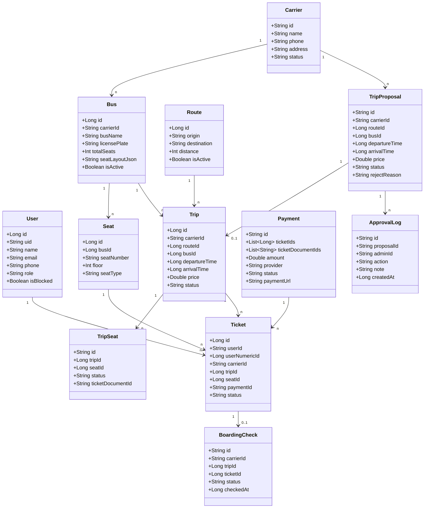

### 4.7 Biểu Đồ Trình Tự

#### 4.7.1 Nhà Xe Gửi Chuyến Và Admin Duyệt

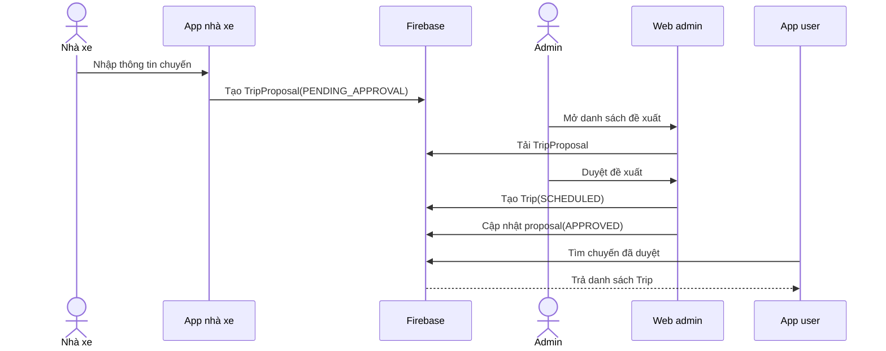

#### 4.7.2 Khách Đặt Vé Và Thanh Toán

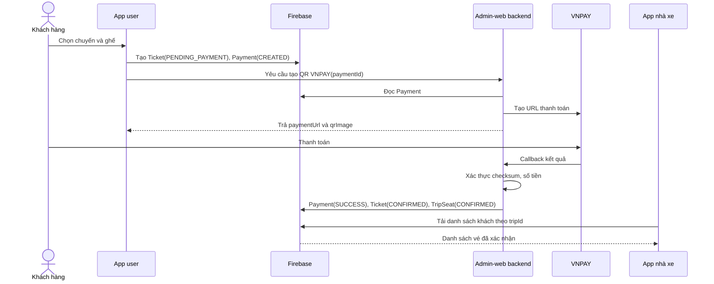

#### 4.7.3 Nhà Xe Kiểm Vé Khi Khách Lên Xe

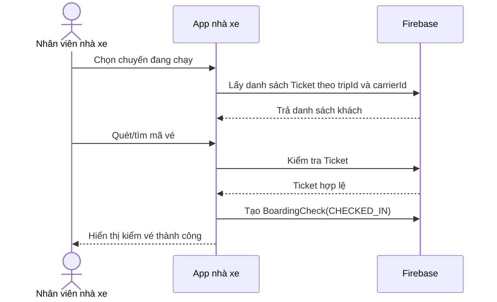

### 4.8 Biểu Đồ Hoạt Động

#### 4.8.1 Hoạt Động Đặt Vé Khứ Hồi

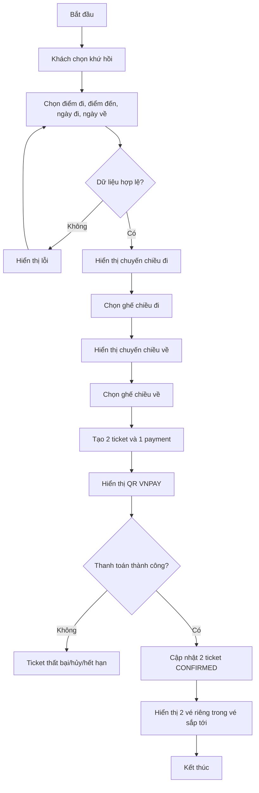

#### 4.8.2 Hoạt Động Duyệt Chuyến

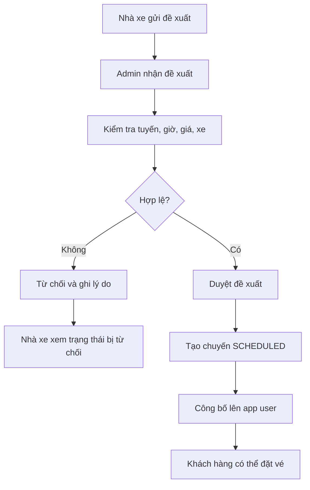

#### 4.8.3 Hoạt Động Kiểm Vé

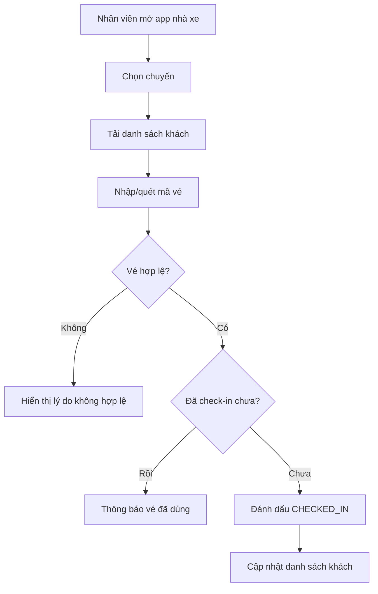

### 4.9 Biểu Đồ Trạng Thái

#### 4.9.1 Trạng Thái Đề Xuất Chuyến

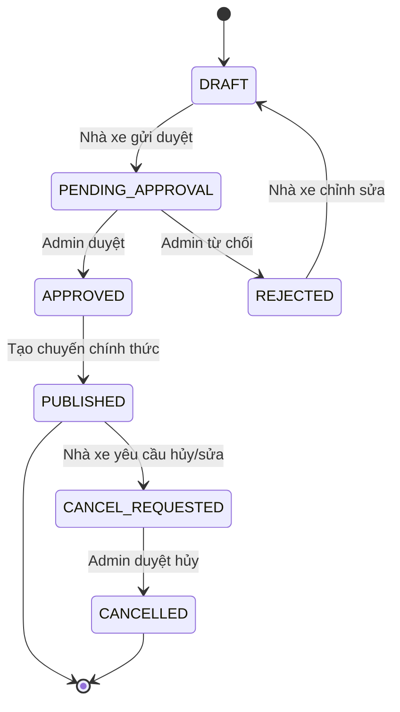

#### 4.9.2 Trạng Thái Vé

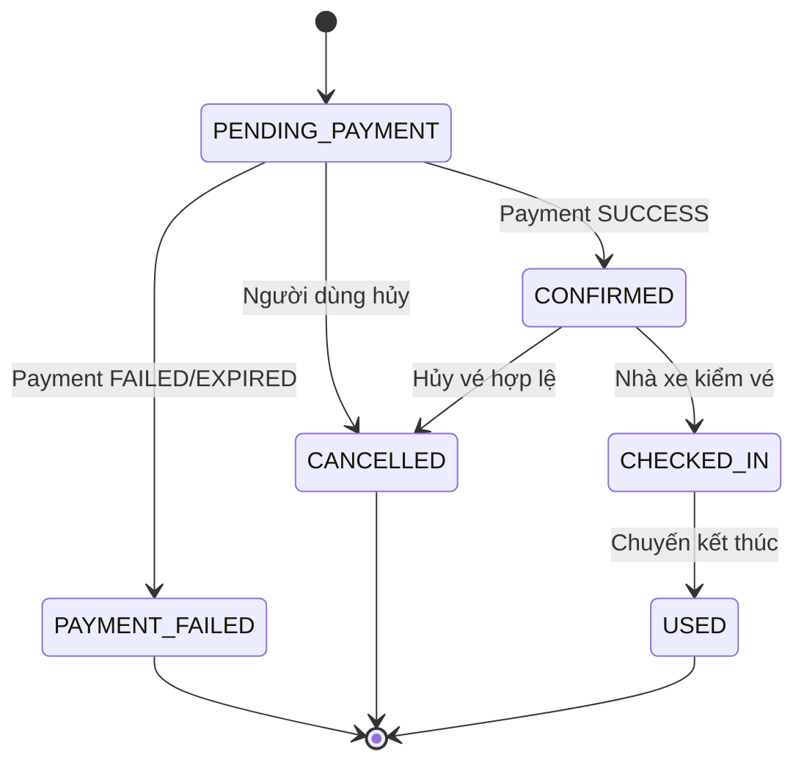

#### 4.9.3 Trạng Thái Thanh Toán

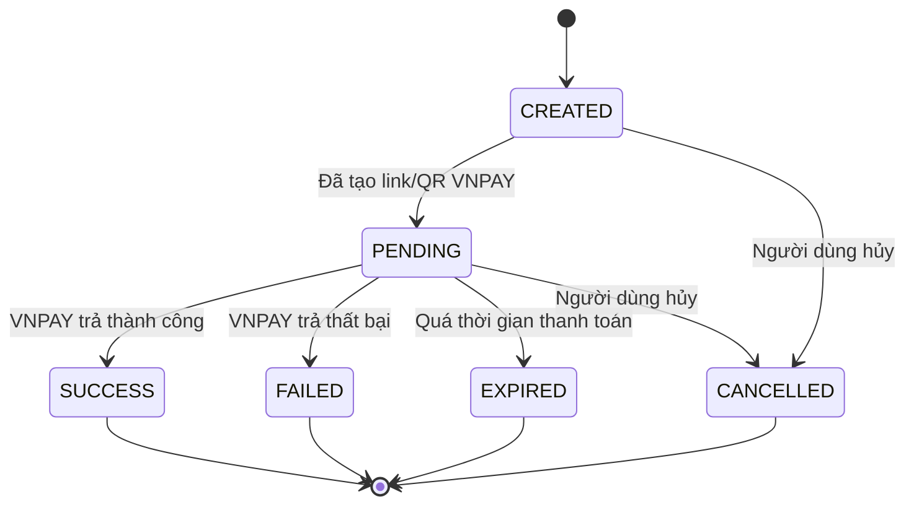

---

## Chương 5: Kết Quả Xây Dựng Và Triển Khai Ứng Dụng

### 5.1 Giao Diện Ứng Dụng

#### 5.1.1 App Khách Hàng

Các màn hình chính:

- Màn hình đăng nhập/đăng ký.
- Màn hình Home:
  - Chọn điểm đi, điểm đến.
  - Chọn một chiều hoặc khứ hồi.
  - Chọn ngày đi/ngày về.
  - Xem chuyến sắp tới, tuyến phổ biến, khuyến mãi.
- Màn hình danh sách chuyến:
  - Hiển thị chuyến đã duyệt.
  - Lọc chuyến đã qua giờ.
  - Hiển thị giờ đi, giá vé, số ghế trống.
- Màn hình chi tiết chuyến:
  - Hiển thị tuyến, xe, giờ đi, giờ đến, giá vé.
- Màn hình chọn ghế:
  - Hiển thị sơ đồ ghế theo tầng.
  - Ghế trống, ghế đã bán, ghế đang chọn.
- Màn hình xác nhận thanh toán:
  - Hiển thị tuyến, ghế, tổng tiền.
  - Với vé khứ hồi, hiển thị ghế chiều đi và ghế chiều về.
  - Hiển thị QR/link VNPAY.
- Màn hình vé của tôi:
  - Vé sắp tới.
  - Lịch sử vé.
  - Chi tiết vé dạng tấm vé.

#### 5.1.2 App Nhà Xe

Các màn hình đề xuất:

- Màn hình đăng nhập nhà xe.
- Màn hình dashboard nhà xe:
  - Tổng chuyến đã duyệt.
  - Số khách hôm nay.
  - Chuyến sắp chạy.
- Màn hình quản lý xe:
  - Danh sách xe.
  - Thêm/sửa thông tin xe.
- Màn hình tạo đề xuất chuyến:
  - Tuyến, xe, biển số.
  - Ngày chạy, giờ đi, giờ đến.
  - Giá vé.
- Màn hình trạng thái đề xuất:
  - Chờ duyệt.
  - Đã duyệt.
  - Bị từ chối.
- Màn hình danh sách khách theo chuyến.
- Màn hình kiểm vé:
  - Quét mã vé/QR.
  - Tìm theo số điện thoại/mã vé.
  - Đánh dấu khách đã lên xe.

#### 5.1.3 Web Admin

Các màn hình chính:

- Dashboard thống kê.
- Quản lý người dùng.
- Quản lý nhà xe.
- Quản lý tuyến.
- Quản lý xe.
- Quản lý đề xuất chuyến.
- Duyệt/từ chối chuyến.
- Quản lý chuyến đã công bố.
- Quản lý vé.
- Quản lý thanh toán VNPAY.

### 5.2 Đánh Giá Hệ Thống

#### 5.2.1 Kết Quả Đạt Được

- Hệ thống phân tách được ba nhóm vai trò: khách hàng, admin, nhà xe.
- App khách hàng đã có luồng tìm chuyến, chọn ghế, thanh toán và xem vé.
- Luồng khứ hồi được thiết kế theo hướng một payment nhưng hai vé độc lập.
- Admin-web đóng vai trò backend xử lý thanh toán VNPAY.
- Dữ liệu chuyến được định hướng theo mô hình nhà xe gửi lên, admin duyệt rồi công bố.
- Có cơ chế kiểm soát ghế đã bán theo từng chuyến.
- Có thể triển khai demo với 2 nhà xe trên Firebase.

#### 5.2.2 Hạn Chế

- Dữ liệu Firebase demo còn giới hạn, chưa thể mô phỏng nhiều nhà xe và nhiều tuyến lớn.
- Chưa có hệ thống thông báo realtime hoàn chỉnh cho nhà xe và khách hàng.
- Chưa có module đối soát doanh thu chi tiết theo nhà xe.
- Chưa có phân quyền chi tiết cho nhiều nhân viên trong cùng một nhà xe.
- Chưa có chức năng hoàn tiền tự động khi hủy vé.
- Chưa có kiểm thử tải với số lượng lớn người dùng và chuyến xe.

#### 5.2.3 Đánh Giá Khả Năng Mở Rộng

Hệ thống có thể mở rộng bằng cách bổ sung trường `carrierId` cho các dữ liệu vận hành như Bus, TripProposal, Trip, Ticket, BoardingCheck. Khi số lượng nhà xe tăng, Firebase Security Rules hoặc backend service cần kiểm tra chặt quyền truy cập theo `carrierId`.

Web admin tiếp tục là trung tâm kiểm duyệt và điều phối. App nhà xe không trực tiếp public chuyến cho khách hàng mà chỉ gửi đề xuất, giúp đảm bảo dữ liệu công khai được kiểm soát.

---

## Chương 6: Kết Luận Và Hướng Phát Triển

### 6.1 Kết Luận Chung

Hệ thống BusBooking được thiết kế nhằm giải quyết bài toán đặt vé xe khách trực tuyến có sự tham gia của ba bên: khách hàng, nhà xe và admin. Với mô hình này, nhà xe có thể chủ động khai báo chuyến, admin kiểm duyệt và công bố, khách hàng đặt vé và thanh toán, sau đó thông tin vé được đồng bộ lại cho nhà xe để kiểm soát khi khách lên xe.

Thiết kế nhiều nhà xe giúp hệ thống có khả năng mở rộng hơn so với mô hình chỉ có một đơn vị vận hành. Trong giai đoạn demo, hệ thống giới hạn ở 2 nhà xe để phù hợp dữ liệu Firebase, nhưng cấu trúc nghiệp vụ vẫn hướng tới khả năng bổ sung thêm nhiều nhà xe trong tương lai.

Luồng thanh toán VNPAY giúp giảm thao tác thủ công và tăng tính tự động trong xác nhận vé. Vé khứ hồi được xử lý theo hướng tạo hai vé độc lập, giúp khách hàng xem chi tiết từng chiều và nhà xe kiểm soát đúng từng chuyến.

### 6.2 Định Hướng Phát Triển

Các hướng phát triển tiếp theo:

- Xây dựng app nhà xe hoàn chỉnh với đăng nhập, dashboard, tạo chuyến và kiểm vé.
- Bổ sung phân quyền nhiều nhân viên trong cùng một nhà xe.
- Hoàn thiện quy trình admin duyệt thay đổi chuyến, hủy chuyến và đổi xe.
- Bổ sung thông báo realtime khi chuyến được duyệt, vé được bán hoặc chuyến thay đổi.
- Bổ sung báo cáo doanh thu theo nhà xe, theo tuyến, theo thời gian.
- Bổ sung đối soát thanh toán VNPAY và xuất báo cáo thanh toán.
- Bổ sung quét QR vé trên app nhà xe.
- Bổ sung hoàn tiền khi hủy vé theo chính sách.
- Tăng cường Firebase Security Rules hoặc chuyển một phần nghiệp vụ nhạy cảm sang backend service.
- Mở rộng dữ liệu từ 2 nhà xe demo lên nhiều nhà xe thật.
- Tối ưu giao diện cho màn hình nhỏ và nhiều dòng xe khác nhau.
- Viết kiểm thử tự động cho luồng đặt vé, thanh toán và kiểm vé.
